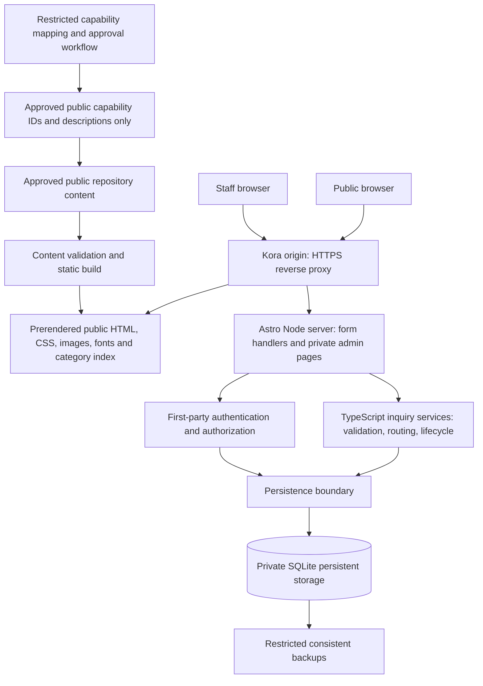
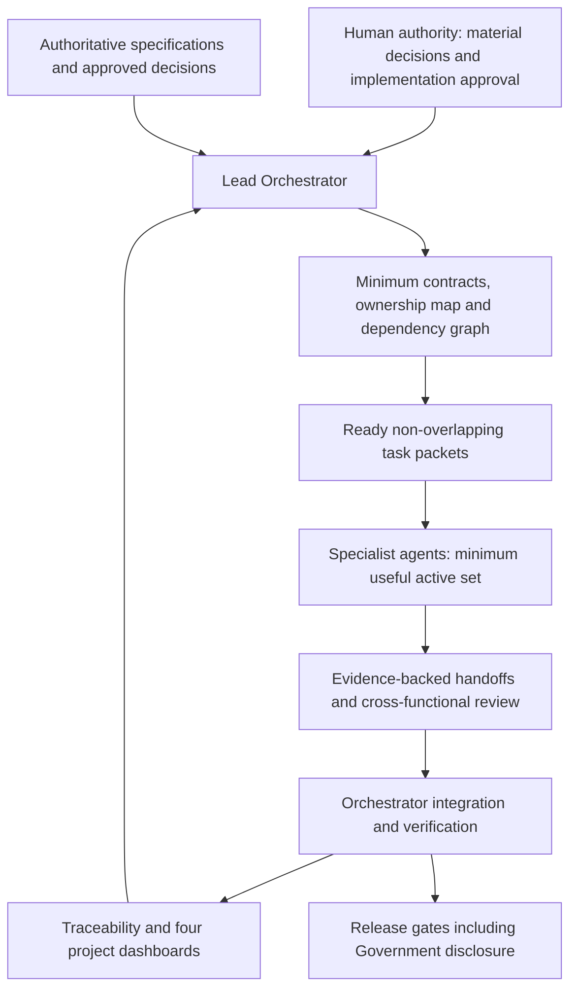

# Kora Business Solutions — Project Plan

**Status:** ACTIVE — approved for implementation on 2026-09-05  
**Version:** 1.3
**Date:** 2026-09-05  
**Scope:** Approved Release 1 implementation and release-readiness  
**Authority:** The three supplied specifications remain authoritative. This plan is a derived proposal, not an amendment or approval of the draft PRD. Explicit user approval is required before implementation.

## Implementation authorization and current state

On 2026-09-05 the user explicitly approved this plan, the Orchestrator/specialist model and PD-001, and instructed implementation through integration/testing/review/readiness. Q01 and Q03 are CLOSED. Historical Phase 1 stop statements below describe prior gates and are superseded by this authorization, not deleted as if approval existed earlier.

The four continuously maintained dashboards now have one canonical location each: [Human Decisions](docs/HUMAN_DECISIONS.md), [Risk Register](docs/RISK_REGISTER.md), [Technical Register](docs/TECHNICAL_REGISTER.md), [Lean Register](docs/LEAN_REGISTER.md). §15.5 retains governance schemas and historical initial records only; do not update a competing dashboard here. Current ownership/contracts: [Architecture](docs/ARCHITECTURE.md). Production Q05/Q06/Q07/Q10 remain open and do not block implementation.

Repository governance is a first-class delivery responsibility. The Orchestrator designates the Ops/QA specialist as the **Repository / DevOps Custodian** (single accountable owner for Git/workspace integrity and GitHub synchronization; no application-feature ownership). The Custodian continuously checks branch state, tracked/untracked/ignored files, conflicts, secret and prohibited-data hygiene, and remote divergence; uses isolated branches/worktrees where practical; coordinates shared-file integration with the Orchestrator; makes logical cohesive commits; and verifies GitHub synchronization at every integration checkpoint. A completed item cannot enter COMPLETE while verified commits remain only local. Secret-bearing environment files and runtime databases remain ignored; safe templates and reproducibility documentation are committed. The Orchestrator remains the integration authority and owns register meaning.

## 1. Executive summary

Kora needs a complete responsive corporate website that explains its business-orchestration model: **Requirement → Connection → Execution**. The primary conversion is **Start a Requirement**. The product serves commercial buyers, public-sector procurement professionals, suppliers, teaming partners, general visitors, and internal administrators.

Release 1 combines a content-first public website with structured first-party inquiry intake and a private inquiry-management application. It covers sourcing/procurement, supply/distribution, medical and invasive technologies, IoT and connected systems, business services, technology enablement, logistics/trade coordination, and partnerships. Government is a prominent first-level destination. Public content uses **Government Registered Supplier**; Kora's internal registration/classification identifiers must never enter public output.

The specification already selects an Astro-based direction. Proposed delivery is one modular TypeScript application: prerendered public content, progressively enhanced forms and local search, server-rendered private administration, a first-party server, and SQLite on persistent Kora-controlled storage. All required runtime assets and functionality remain first-party. No application code, dependencies, infrastructure, or business content have been implemented in this phase.

The product is technically feasible within these boundaries. The user has generally approved the Phase 1 direction, but has explicitly withheld implementation approval pending this revision. Final content/mapping ownership, privacy/retention approval and hosting/operations are production gates, not prerequisites for architecture, UX scaffolding, schemas, synthetic tests or implementation. Routine technical choices are recorded engineering decisions. The user has resolved Q03: partner forms require contact name, email and a meaningful capability/partnership summary; organization is optional. Only final implementation approval remains before baseline development. Reverse/reopen status transitions are excluded rather than assumed. Delivery will follow the Orchestrator/specialist ownership, contract and evidence gates in §15; this is implementation governance, not additional product scope.

## 2. Source review and workspace inventory

All three documents were read completely. References below use **C §n** for the Constitution, **O §n** for the Operating Protocol, and **P §n** for PRODUCT_REQUIREMENTS.md. Requirement IDs retain their PRD meanings.

| Existing item | Inspection result |
|---|---|
| `01_AI_ENGINEERING_CONSTITUTION.md` | 34,872 bytes; actually a DOCX/ZIP package despite its extension. Read all document paragraphs from its embedded Word XML, including table paragraphs. Contains 30 sections of engineering/product governance. |
| `02_AI_PROJECT_OPERATING_PROTOCOL.md` | 49,787 bytes; also a DOCX/ZIP package. Read all document paragraphs from embedded Word XML. Version 3.0; 62 sections of documentation and autonomous-development governance. |
| `PRODUCT_REQUIREMENTS.md` | 125,501 bytes; actual Markdown, 2,431 lines. Draft version 0.2, dated 2026-09-04; all 48 sections read. |
| `.git/` | Empty directory; no repository metadata/history or configuration to inspect. Source-control initialization is future work, not assumed complete. |
| `.agents/` | Empty directory; no workspace agent instructions. |
| `.codex/` | Empty directory; no additional project configuration. |

This inventory records the original Phase 1 workspace, including hidden entries. PROJECT_PLAN.md was subsequently created and is the only file changed during this revision. There is no application, package manifest, lockfile, test suite, CI, deployment configuration, approved media, or populated content collection. No unrelated directories or credential stores were inspected. No external sources were consulted: technology names here derive from P §28, and current versions, compatibility, maintenance, licensing, and asset terms remain future verification work. Embedded packaging/style metadata is not an additional project specification; the document text was decoded without extracting or modifying the authoritative files.

Source SHA-256 fingerprints:

```text
01_AI_ENGINEERING_CONSTITUTION.md
fab4b54dca14da074cc237809663905749de1fdd131ce82bc226c90e806e5cfc
02_AI_PROJECT_OPERATING_PROTOCOL.md
057e266e1a1a9a394377ce092494f60781425d32531ce202b4f4af9014532a53
PRODUCT_REQUIREMENTS.md
7c1ef7d5126918ab20eb30f789524c7a8f84f2bc3dee86c944773e287c14bec1
```

## 3. Understanding of the product and scope

The website must make Kora understandable quickly without reducing it to a generic IT, logistics, staffing, distribution, or contracting company. Visitors explore approved capabilities or describe an incomplete requirement; staff then review that inquiry in GENERAL, PROCUREMENT, or CONTRACTS queues. Routing does not send automated email. Public mailto/tel links provide independent direct contact actions.

Approved public information is centralized: Kora Business Solutions; info@korasb.com; procurement@korasb.com; contracts@korasb.com; 609-469-6366; Princeton, New Jersey 08540. No personal employee email or inferred street address is needed.

### 3.1 Route inventory

All route patterns below are Release 1 scope, subject only to explicit approved removal. Dynamic article routes are generated only for published entries. A true unknown URL must return a 404 response using the recovery experience.

| Area | Routes | Main responsibility |
|---|---|---|
| Home | `/` | Hero, requirement launcher, capability relationships, process, Government, partners, published insights, final CTA |
| Capabilities | `/what-we-do` | Outcome-oriented overview and links to all seven capability pages |
| Capability detail | `/what-we-do/sourcing-procurement`, `/what-we-do/supply-distribution`, `/what-we-do/medical-invasive-technologies`, `/what-we-do/iot-connected-systems`, `/what-we-do/business-services`, `/what-we-do/technology-enablement`, `/what-we-do/logistics-trade` | Definition, examples, Kora's role, process, related capabilities, preselected request CTA |
| Sourcing directory | `/products` | Approved local categories, search/filter, sourcing disclaimers, zero-result request path |
| Government | `/government`, `/government/contracting` | Supplier status, approved capabilities, acquisition paths, process, procurement/contracts actions, print support |
| Partners | `/partners`, `/partners/suppliers`, `/partners/teaming` | Distinct supplier/teaming paths and forms |
| Company/editorial | `/about`, `/insights`, `/insights/[slug]` | Factual operating model and locally authored published articles |
| Intake/contact | `/request`, `/contact` | Structured requirement flow and simple general contact form; role-based direct contacts |
| Trust/recovery | `/privacy`, `/accessibility`, `/404` | Accurate notices, contact for concerns, accessible recovery without forced redirect |
| Private administration | `/admin/login`, `/admin/inquiries`, `/admin/inquiries/[id]` | Authentication, inbox, detail, status, notes, filtered CSV, deletion |

Navigation must include What We Do, Products, Government, Partners, Insights, About, and a distinct Start a Requirement CTA. Header/footer appear on every public page. The brand links home. Deep pages use useful breadcrumbs. Mobile uses an accessible full-height drawer with explicit close, focus containment/return and Escape support. A desktop mega-menu is optional in F-001 but listed among expected reusable components; proposed design includes it with equivalent ordinary links. Admin routes never appear publicly.

Preserve all contextual links in P §37: home to capabilities/Government/partner paths; capability overview to every child; each child to a related capability and request; product/medical/IoT/Government CTAs to their prescribed query aliases; Government and contracting to one another, appropriate contacts and teaming; partners to both forms; articles to relevant capabilities or request; About to request/Government/partners; trust pages to recovery/contact paths. Optional downloads appear only when a current approved artifact exists.

### 3.2 Explicit exclusions and conditional features

No commerce, cart, payment, guaranteed quoting, live stock, order tracking, marketplace, CRM, consumer/customer/supplier accounts, bidding, warehouse/freight management, medical advice, regulated-document repository, public uploads, live chat, visual CMS, marketing automation, or Release 1 native app. No remote analytics, maps, fonts, scripts, CAPTCHA, form processor, hosted search, identity provider, email-delivery integration, or required SaaS service.

Native operational apps, authenticated portals, notifications, opportunity exchange/matching, saved requirements, uploads, quotes, tracking, self-hosted analytics, careers, multilingual content, case studies, PWA/offline, and expanded search remain deferred candidates (P §§5, 45). Full-site search is also called optional in F-013; propose omitting it for Release 1. Product-category search is required. Public capability PDF, team profiles, reading time, product detail pages, and published insight count are conditional rather than grounds to invent content. No approved insights means an intentional empty index and hidden homepage preview.

## 4. Requirements traceability

Appendix A enumerates every explicit FR identifier and its source wording, with planned delivery/verification ownership. The following tables cover unnumbered requirements, business rules, quality attributes, and governance. All implementation and test evidence is currently **NOT STARTED**; planned verification is not a test result.

### 4.1 Goal-to-delivery mapping

| Goal | Delivery | Verification |
|---|---|---|
| G-001 Differentiation | F-002, F-004, F-008; custom brand system | First-viewport messaging and factual content/design review |
| G-002 Structured inquiries | F-003, F-007, F-010, F-012 | Every inquiry variant persists and reaches the right queue; recovery tests |
| G-003 Factual credibility | F-006, F-014, F-015; approved sources and public data boundary | Approval metadata, artifact review, disclosure-negative tests |
| G-004 Multiple audiences | F-001, F-004, F-006, F-007, F-010 | Navigation and buyer/Government/partner/mobile journeys |
| G-005 Rich and fast | F-002, P §§24, 26, 32–33, 36 | Performance budgets, reduced motion, keyboard/reflow/visual review |
| G-006 Independent operation | F-003, F-012, F-013, P §28 | First-party network inventory, offline third-party dependency test |
| G-007 Government engagement | F-006, F-003, F-010; BR-029 | Acquisition-type routing, Government CTAs, print and content tests |

### 4.2 Business-rule coverage

| Rules | Extracted obligation | Planned enforcement |
|---|---|---|
| BR-001, 004, 024, 026–028 | Approved evidence and ownership; internal capability mappings; exact supplier status; no identifier disclosure, including downloads | Separate public content schemas, restricted internal source references, review records, build/runtime disclosure gates |
| BR-002–003 | No inventory implication or e-commerce | Directory-only UI/content and absence-of-commerce review |
| BR-005, 016 | Accurate business name and centrally managed approved contacts | Shared public business data; content/link assertions |
| BR-006, 012–014 | First-party storage/runtime, no external tracking, no conventional unnecessary cookie banner | Deployment/network review; storage/cookie inventory |
| BR-007–009, 023 | Minimize data, warn against sensitive data, no uploads, no sensitive logs | Conditional schemas, notices, bounded payloads, reject uploads, log allowlists |
| BR-010–011 | Supplier/teaming submission creates no qualification, partnership, award or business guarantee | Form/page/success wording review |
| BR-015, 019 | Valid CTA targets; no draft publication | Route graph/link checks, published-only collection queries |
| BR-017–018 | Image rights; no implied ownership/endorsement or agency endorsement | Media provenance and manual editorial approval |
| BR-020 | Private admin and inquiries never publicly cached/indexed/generated | Auth checks, no-store, build/sitemap isolation |
| BR-021–022 | Configurable retention; consistent deletion of notes and audit references with minimal justified audit retention | Approved lifecycle policy; transactional purge; restore/deletion tests |
| BR-025 | Equivalent accessible action/content across interaction modes | Keyboard, touch, motion, screen-reader tests |
| BR-029 | Contextual GENERAL/PROCUREMENT/CONTRACTS routing | Deterministic server precedence in §5.2 and exhaustive variant/context tests; Q02 recorded decision |
| BR-030–032 | Business/procurement framing for medical; no patient data or unverified clinical/IoT claims | Source approval, minimized fields, boundary notices and tests |
| BR-033 | Domain logic independent of page templates | Domain/application/persistence boundaries and architecture review |

### 4.3 Non-functional and cross-cutting coverage

| Source | Extracted requirement | Delivery / acceptance evidence |
|---|---|---|
| P §§7–8, 24, 36; C §§9–12, 17; O §§18–21 | Premium editorial responsive design; logical mobile layouts from 320px, tablet portrait/landscape, desktop through 1536px+; 200% text zoom; orientation preserves state; hover/tap/focus parity; sticky UI cannot obscure focus | Design tokens and reusable components; responsive, touch, zoom, focus and orientation review |
| P §24 | Custom geometric K/path/convergence SVG master; horizontal/symbol/dark/light logo variants; one-color/favicon viability; accessible brand name. Proposed ink/paper/stone/signal/graphite/mist/sage palette; verify combinations; avoid signal small text on paper. Local Space Grotesk/Inter or licensed equivalents, limited weights, roughly 16px mobile body and 45–80-character reading lines | Brand/design review and asset/license/contrast checks; exact proposed colors stay in P §24.4 |
| P §§24, 26 | Typography/CSS/SVG lead visual identity; meaningful transform/opacity motion with reduced-motion alternative; no scroll hijack, unnecessary loops or blocking transitions; editorial local stock with rights/provenance; responsive modern derivatives, dimensions, alt, lazy loading | Asset manifest/build checks; manual imagery review; visual and performance tests |
| P §32 A11Y-001–009 | WCAG 2.2 AA across public/admin; semantics, keyboard, focus, labels/live announcements, contrast, reduced motion, 44px preferred targets, zoom/reflow, textual error recovery | axe plus manual keyboard/screen-reader/contrast/zoom review; automation alone is insufficient |
| P §33 | Where measurable, p75 LCP ≤2.5s, INP ≤200ms, CLS ≤0.10; core mobile transfer generally <~1.5MB, excluding requested downloads; zero required third-party scripts; minimal JS/fonts and responsive media | Lab performance and byte budgets in CI; production percentile evidence only if approved first-party measurement exists; no fabricated field metrics |
| P §34 REL-001–005 | Informational pages usable on database failure; retain current-session input and allow retry without false receipt; safe admin errors; fail missing-content checks; no external failure cascade | Static build separation; outage, retry, missing-content and dependency tests |
| P §31; BR-007, 021–023 | Purpose-limited collection; no behavioral profiles, ad sharing, keystroke/abandoned-text capture; no default draft text localStorage; only non-sensitive UI state cleared on success; minimized IP logs | Storage/log review, retention/deletion tests, privacy notice reconciled to actual operations |
| P §§29–30 SEC-001–014 | Bounded validation, parameterized queries, CSRF/XSS controls, first-party secure auth/rate limits, local assets/headers, deployment-injected secrets, no public admin cache, restricted data isolation, dependency review | Security design in §8 below; negative tests and pre-release evidence |
| P §§35, 38 | Typed local content; central contacts/navigation/status; approval/source metadata for medical/IoT; no public drafts; explicit empty/loading/error/success states across public/admin | Content validation and state-specific component/E2E tests |
| P §§39–40, 47 | Requirements-based tests, release acceptance, backed-up/restorable data, HTTPS, no critical security issue, traceable documentation | Release checklist tied to all 26 P §40 conditions; restore drill and review evidence |
| C §§13–25; O §§22–30, 34–41, 55–56 | Simple modular maintainable architecture; dependency cost/license/security review; data ownership/constraints/transactions; clear interfaces; failure/concurrency design; observable operations; no speculative infrastructure | Architecture/data/security decisions and meaningful review; no microservices, queues or separate API tier without a demonstrated need |
| C §§3–8, 23–30; O §§1–17, 31–62 | Preserve authority, document assumptions/conflicts, ready/done/release gates, traceability, proportional durable documents, self-review, truthful evidence and post-release learning | This plan records gaps; later changes map requirement → rule → flow → component/API/data → code → test → measurement where applicable. Update only relevant artifacts; approval precedes implementation |

## 5. Intake behavior and field model

### 5.1 Inquiry variants

P §12 headings label some fields “Required” while qualifying them “if known/relevant/applicable.” Engineering interpretation: unqualified required fields are mandatory; qualified fields accept absence when unknown or inapplicable. Never force invented quantity/date/location data. This does not need a separate user decision. Q03 has been answered and absorbed into §5.1.1; it is no longer a blocker.

| Type | Required / conditionally required source fields | Optional fields |
|---|---|---|
| PRODUCT | Title/product/category, description; quantity/range and timing if known; delivery city/region/country if relevant | Brand preference, substitution Yes/No/Unsure, notes |
| MEDICAL_TECHNOLOGY | Business/procurement summary; category/use context and quantity/scope/timing when known; delivery/work location when relevant | Brand, model/reference, substitution, non-sensitive regulatory/facility constraints |
| IOT_CONNECTED_SYSTEMS | Business objective/problem, device/system context, desired outcome; timing if known | Environment type, approximate endpoint count, non-sensitive connectivity constraints, integration goals |
| SERVICE | Service summary, desired start/timing; work location or remote applicability if known | Duration, capacity estimate, constraints |
| LOGISTICS | Shipment/coordination summary and timing; origin/destination if known | Cargo type, estimated dimensions/weight, mode, trade notes |
| TECHNOLOGY | Business objective/problem, desired outcome; timing if known | Current environment summary, non-sensitive integration constraints |
| GOVERNMENT | Agency/organization, opportunity summary, acquisition type; response/due date if applicable | Notice number, public solicitation URL, appropriate set-aside/category info, contract/vehicle reference, non-sensitive instructions |
| OTHER | Plain-language description | Common optional contact fields |
| SUPPLIER | No individual field is explicitly labeled required by FR-007.3; all listed fields must be present in the form. User-approved mandatory: contact name, email, meaningful capability/partnership summary | Organization, supplier type, separate categories, operating region and website; see Q03 and detailed model below |
| TEAMING | No individual field is explicitly labeled required by FR-007.7; listed fields must be present. User-approved mandatory: contact name, email, meaningful capability/partnership summary | Organization, geographic coverage, partnership interest and voluntarily supplied relevant business information; see Q03 |
| GENERAL | Name, email, message | Organization, phone, topic |

Request contact fields are name, email, summary/details required; organization, job title, phone, preferred contact method optional, except Government agency/organization is explicitly required by its variant. Do not duplicate the same summary question merely to satisfy multiple labels. General contact lacks a required title: propose deriving its admin display subject from topic or type rather than collecting another mandatory field.

Government acquisition choices must include RFQ, RFP, RFI, RFC/agency-defined request, fixed-price/FFP, solicitation, contract, subcontract, teaming, and other public-sector requirement. Kora identifiers are neither prefilled nor accepted as authoritative public submission fields. Visitor-supplied notice/vehicle references are distinct from Kora's own restricted records.

### 5.1.1 Partner-field evidence and approved minimum-data decision

FR-007.3 says supplier fields **“must include”** contact name, email, organization, supplier type, capabilities/categories, operating region, website if applicable and free-form summary. It does not label any of these individually required. FR-007.7 likewise says teaming fields **“must include”** contact, organization, capability summary, geographic coverage, voluntarily supplied relevant business information and partnership interest; it does not enumerate mandatory fields. Presence of a control is not mandatory completion.

P §12.3 explicitly requires name, email and requirement summary/details for request types, with organization optional. The current explicit user decision adopts that shared minimum for both partner paths. This clarifies mandatory completion without changing the PRD-listed fields or claiming F-007 explicitly labels them required:

| Form | User-approved mandatory completion | Present but optional |
|---|---|---|
| Supplier | Contact name, email, meaningful capability/partnership summary | Organization, supplier type, capabilities/categories selection, operating region, website when applicable |
| Teaming | Contact name, email, meaningful capability/partnership summary | Organization, geographic coverage, partnership interest, voluntarily supplied relevant business information |

All F-007 controls remain available. The supplier summary must permit a meaningful account of capabilities without forcing a duplicate category answer. The dedicated teaming path establishes the general intent; a separate partnership-interest field can refine it voluntarily. No bank/tax/SSN/credential/document collection is added.

**PD-001 / Q03 — APPROVED and absorbed (2026-09-05):** require contact name, email and a meaningful capability/partnership summary; organization is optional. The user explicitly selected this minimum-data model so legitimate individual suppliers, specialists and teaming participants can submit. All other listed controls remain present and optional as specified above. This section is the durable decision location while the three original specifications remain unchanged. Downstream effect: supplier/teaming schemas, labels, validation and tests must accept an omitted organization and reject a missing name, email or meaningful summary. Do not invent a business-qualification rule or require duplicate summaries. Human Decision Q03 is CLOSED; do not ask again.

### 5.2 State, routing and reliability

Public states: START → TYPE_SELECTED → DETAILS → CONTACT → REVIEW → SUBMITTING → SUCCESS, with VALIDATION_ERROR, RATE_LIMITED and SERVER_ERROR recovery. Form steps announce progress and errors, preserve current-page values, support back/edit, and provide review before submit. Homepage/category query aliases preselect public types; `product`, `medical`, `iot`, and `government` map to domain enums. Unknown query values must safely fall back to type selection, never become trusted routing input.

#### Deterministic routing precedence — recorded decision Q02

The server validates the inquiry type and applicable business-context/acquisition fields, then evaluates the following table **top to bottom, first match wins**. It writes exactly one queue. An incoming `routing_queue` is rejected as an unsupported public input, never persisted or used as an override. Invalid or contradictory type-specific fields cause validation errors; no keyword guessing from free text is used.

| Priority | Validated condition | Assigned queue |
|---|---|---|
| 1 | GOVERNMENT with RFQ or RFI acquisition type | PROCUREMENT |
| 2 | GOVERNMENT with RFP, RFC/agency-defined request, fixed-price/FFP, contract, subcontract or teaming acquisition type | CONTRACTS |
| 3 | GOVERNMENT with Solicitation or Other public-sector acquisition type | CONTRACTS |
| 4 | TEAMING | CONTRACTS |
| 5 | SUPPLIER, PRODUCT or MEDICAL_TECHNOLOGY procurement inquiry | PROCUREMENT |
| 6 | IOT_CONNECTED_SYSTEMS, TECHNOLOGY, SERVICE or LOGISTICS with explicit contracting context | CONTRACTS |
| 7 | The same four types with explicit procurement context | PROCUREMENT |
| 8 | Those four types with general/unspecified context; OTHER; GENERAL (including privacy/accessibility contact) | GENERAL |

Rows 1–2 implement P §12.4/BR-029 and take precedence over generic capability or context: a Government RFP for products routes to CONTRACTS; a Government RFI about technology routes to PROCUREMENT. Contract-administration context routes to CONTRACTS under a Government contract requirement or an applicable contracting context; it does not create a new acquisition type. Rows 4–5 preserve the PRD's distinct supplier/teaming/product/medical defaults.

Row 3 records a bounded routing assumption for previously unspecified Government choices: CONTRACTS is the fallback for unclassified public-sector opportunities. OTHER defaults to GENERAL. These defaults are explicit under the user's instruction to resolve deterministic routing, not new approval blockers. An acquisition value outside the permitted enumeration is invalid rather than silently routed.

For the four general-capability types, represent the procurement/contracting selection already contemplated by P §12.4 as one optional, mutually exclusive business-context field: general, procurement or contracting. No context means general. The server accepts context only in these types' schemas and derives the queue; it rejects inapplicable context instead of silently ignoring it or accepting it as a queue override. Government uses its acquisition selector, and supplier/teaming/product/medical/general paths use their defined type rules. No new queue, manual reassignment UI/API or automatic content classifier is introduced.

#### Idempotent receipt and failure model — recorded decision Q09

Issue a first-party opaque attempt token before submission, preserve it through double-clicks and retries, and validate it on the server. It identifies an attempt, not a public account. Validate input and abuse controls, derive routing, then atomically bind the unique attempt to a normalized payload digest, inserted inquiry and non-guessable public reference in a SQLite transaction. A uniqueness constraint serializes competing submissions of the same attempt. Return success only after confirmed commit.

- Retry of an accepted attempt with the same normalized payload returns the original public reference without inserting a second inquiry, including after a lost response or application restart.
- A reused attempt with a different payload returns a safe conflict, never an additional inquiry. Preserve entered text; do not automatically mint a new attempt while the prior result is uncertain.
- A known rollback/pre-commit failure permits retry of the same attempt. An unknown server outcome is resolved by its durable token binding before another insert is attempted.
- Expired or retired attempt tokens are rejected, never treated as fresh requests. Their server-verifiable validity and binding retention must overlap so removing an idempotency record cannot make an old accepted token insertable again. After inquiry deletion, do not recreate it or return its deleted receipt; retire the attempt. Engineering chooses bounded token lifetime/retention consistently with these invariants and tests expiry/deletion races.
- Do not expose inquiry lookup by public reference. Possession of the original opaque attempt is required to recover that attempt's receipt; response contains only the safe receipt, not inquiry contents. Tokens and free text are never logged.

User messaging follows observable evidence: confirmed commit → received plus public reference; known non-persistence → not received with retry; ambiguous timeout/connection loss → **“We could not confirm whether your request was received. Retry this submission to check without sending a duplicate.”** Preserve current-page input and token. Never infer non-receipt from a browser network error, or receipt from merely initiating a POST. No abandoned free text is persisted in localStorage. These decisions implement the user's clarification without further copy approval.

#### Admin status-transition model — recorded decision Q04

Use the P §12.1 forward lifecycle, with SPAM an alternate terminal state:

| Current state | Allowed next states | Not allowed |
|---|---|---|
| NEW | IN_REVIEW, SPAM | CONTACTED, CLOSED; any unknown value |
| IN_REVIEW | CONTACTED, SPAM | NEW, CLOSED; any unknown value |
| CONTACTED | CLOSED, SPAM | NEW, IN_REVIEW; any unknown value |
| CLOSED | None | All other states, including SPAM |
| SPAM | None | All other states |

New persisted inquiries start at NEW. Marking spam from any nonterminal state is the explicit interpretation of alternate terminal state. Setting the current state again is an idempotent no-op, not a transition or duplicate audit event. The server enforces transitions regardless of available UI controls. Allowed changes and their actor/timestamp/action audit records commit atomically. Concurrent changes use a version check so a stale update cannot bypass the graph. Notes and deletion retain their separate PRD permissions; they do not implicitly reopen or reassign inquiries.

FR-012.11 lists permissible status values but does not explicitly authorize every pairwise transition. Therefore no reverse/reopen, unspam, skipped forward step, or CLOSED-to-SPAM transition is implemented. The exact additional authority required **if later requested** is permission for each additional edge, such as CLOSED → IN_REVIEW or SPAM → NEW, with audit semantics. These are OUT OF CURRENT SCOPE, not blockers to implementing this forward-only model. Manual queue reassignment is also excluded; no authoritative requirement requires it.

## 6. Proposed architecture and technology choices

### 6.1 System topology



The boundary from internal mappings to public content is a deliberate approval/export boundary, never a general-purpose serialization of internal objects. Build inputs should contain only approved public material; a restricted internal review can certify mappings without copying internal identifiers into the public repository. Public content does not query the live inquiry database.

### 6.2 Proposed choices and alternatives

| Concern | Proposed choice | Reason, trade-off and status |
|---|---|---|
| Rendering | Astro, prerendered informational routes and server-rendered dynamic routes using a Node deployment adapter | Explicit D-003 and P §28 direction. A client-heavy SPA increases unnecessary JS; purely static hosting cannot satisfy first-party persistence/admin. Adapter/version verification deferred |
| Domain | TypeScript modules independent of Astro request/page objects | Required native-readiness boundary; no native SDK or public mobile API now |
| Styling | Open-source Tailwind CSS with centralized brand tokens and semantic components | PRD baseline; no commercial template dependency |
| Interactivity | Small Preact islands where useful, primarily intake/search; native HTML and small scripts elsewhere | PRD permits this. Preserve no-JS navigation/content and propose ordinary server form fallback; no global SPA hydration |
| Motion | CSS/native Web Animations first | Permitted baseline; Motion only if a measured, justified interaction needs it |
| Content | Typed local Markdown and structured data, MDX only for a justified trusted-author need | Source-controlled, schema-validated, no CMS runtime or untrusted rich text |
| Persistence | SQLite with explicit migrations and prepared statements behind a small repository boundary | Release 1 baseline. One writer deployment and durable local volume proposed; no ephemeral/serverless database placement. PostgreSQL migration only when justified |
| Auth | Local users and server-side revocable sessions; modern password hashing | Required first-party approach. Exact hashing library, cost, session limits and security parameters require later technical validation; no custom cryptographic primitives |
| Icons/brand/media | Custom SVG logo, local SVG icons, local licensed WOFF2 and optimized editorial media | Required first-party assets and brand deliverables; no generated raster/logo work in this phase |
| Verification | Vitest, Playwright, axe-core, Lighthouse CI or permitted equivalents | PRD baseline. Exact maintained versions and compatibility checked at dependency selection |
| Hosting | One Node application/container behind Caddy; Nginx or standard Node service is a supported deployment alternative | Portable self-hosting, small operational footprint. Host, budget and environment ownership are Q07 |

No dependency is installed or locked. Version pins, package-manager choice, SQLite driver, validation library, image tooling, and build/test compatibility must be checked against current official sources after this workspace-only phase. These are technical selection tasks, not requests to change the product.

### 6.3 Components and modules

| Module | Responsibilities |
|---|---|
| Public shell/design system | Header/mega-menu/drawer/footer, breadcrumbs, buttons, CTA panels, headings, capability/Government cards, timelines, notices, article cards; semantic state variants |
| Content and publication | Typed capabilities/categories/articles, central business/navigation data, source/approval metadata, published-only selection, related links, print styles, social images, sitemap/robots/JSON-LD |
| Requirement UI | Type selection, conditional groups, progress, contact, review, validation summary, loading/retry/receipt, warnings, query aliases |
| Partner/contact UI | Supplier and teaming distinctions; shared field/submit behavior; general form and role-based mailto/tel |
| Discovery | Local category dataset, search/reset/result count/zero state; browsable HTML fallback |
| Application/domain services | Submission, receipt recovery, inbox queries, status/note/deletion/export use cases; coordinate rules and persistence without Astro dependencies |
| Validation/routing/status rules | Pure TypeScript schemas, allowed fields, type aliases, deterministic queue precedence and status graph; independently testable and not embedded in UI/controllers |
| HTTP/controllers | Thin first-party handlers: parse transport, apply request limits/origin/CSRF/session checks, invoke services, map outcomes to HTTP/HTML/JSON; no duplicated business rules |
| Persistence | Migrations, parameterized queries, transactions, constraints/indexes, persistence errors, deletion consistency |
| Authentication/session | CLI provisioning/recovery, password verification, login/logout/session rotation/expiry/revocation and active-admin checks; one uniform admin authority, no permission tiers |
| Admin presentation/UI | Inbox/filter/search, detail, allowed-status controls, notes/delete/CSV UI; uses controllers rather than accessing storage or defining rules |
| Internal Government capability data | Restricted server-only configuration/records, mapping references, source ownership and approval workflow; physically/logically separate from public content/builds; no registration management UI |
| Operations/verification | Health/logs, backup/restore/purge procedures, deployment/rollback, content/link/disclosure/security/performance tests |

Dependency direction is **presentation/UI → HTTP/controllers → application/domain services → validation/routing/status rules and persistence interfaces**. SQLite adapters implement persistence; authentication/session is a separate server boundary used by controllers and enforced for private use cases. Internal Government capability data is a separate restricted concern that yields only approved public descriptions/IDs through publication review. UI templates cannot import the database or restricted records. Services and rules do not import Astro, browser state or request/response types. These are modules in one application, not separate services or infrastructure. Future authorized native HTTP adapters can invoke the same services and rules; Release 1 includes no native app or speculative mobile API.

Proposed browser interfaces are same-origin POST submission, login/logout, status/note/delete/export actions and authenticated GET inbox/detail/filter views. Exact handler paths and response contracts belong in later architecture work; public and admin route inventory remains unchanged. No public inquiry lookup, unsolicited GET API, third-party webhook, registration lookup API, or URL-fetching service is required. Solicitation URLs are validated strings/links, not fetched by the server.

## 7. Data model

P §29 is the conceptual schema authority. Additional implementation support records below are explicitly proposed, not new user-facing features.

| Entity | Required source semantics and proposed relationships |
|---|---|
| Inquiry | Internal id; unique non-guessable public_reference; one of 11 types; one of three routing queues; five statuses; contact name/email, optional organization/phone; subject/title, details, validated type-specific structured_data; created_at/updated_at; retention_until if approved. Job title/preferred contact method may live in validated contact metadata. Proposed version for concurrent updates |
| AdminUser | id, unique username, password_hash, active, created_at, optional last_login_at. No public user account |
| InquiryNote | id, inquiry_id → Inquiry, admin_user_id → AdminUser, encoded plain-text note, created_at |
| AuditEvent | id, actor admin_user_id, action, target_type/id, minimal non-sensitive metadata, created_at. Deletion must reconcile target references with approved retention policy |
| GovernmentCapabilityMapping | Internal id, status/reference, classification type/code, optional registration reference, approved public capability id, approval boolean, owner, verified_at, internal notes. Restricted server-only configuration is the baseline; real sources/owners are Q05 production gates, synthetic mappings support development |
| Public Capability / Category | Proposed local schema: stable public id/slug, approved descriptions/examples/process/links, publication state, source-owner/approval metadata with no restricted values; categories drive local search |
| Insight | Title, slug, summary, publish date, optional updated date, topic, body, SEO title/description, local social image; explicit publication state and relevant internal links |
| Media record | Local path, source platform/page, creator if available, download date, license reference at selection, placement, approval, representation/rights notes |
| Session (proposed) | Opaque token hash, admin owner, creation/expiry/revocation context; raw session secret only in secure cookie, never logs |
| Idempotency record (proposed) | Unique token binding to payload digest and inquiry result with bounded validity; avoids retaining an extra copy of free text. Policy must prevent resurrection/leakage after inquiry deletion |

Relationships: Inquiry has many Notes; AdminUser authors Notes/AuditEvents and owns Sessions; approved public capabilities may have multiple restricted mapping references. Public content has no foreign-key path exposed to inquiries or administrative records.

Proposed database controls: explicit enum/check constraints, uniqueness on username/public reference/idempotency token, foreign keys, atomic inquiry/receipt handling and admin mutation/audit writes, and indexes for newest-first ordering plus type/queue/status and reference lookup. Index email/name/organization according to measured search needs; do not add a search service. Date-only deadlines must retain date semantics; use consistent UTC instants for audit/system timestamps and define display timezone separately. Quantity ranges and “if known” fields require schemas that do not force spurious numeric values.

All accepted input is length-bounded; schemas reject unknown enums/fields and invalid dates/URLs. Email syntax is validated without external verification. Data files and database/backups reside outside the public root. Retention values must be configurable; 24 months for inquiries and possible spam deletion after 30 days are provisional, not approved production policy. Notes, exports, sessions, idempotency bindings, audit metadata, logs and restored backups need coordinated expiry/deletion behavior under Q06.

## 8. Security and privacy model

Assets are inquiry contact/business information, staff credentials/sessions, internal notes/audits, restricted Government records, and publication integrity. Trust boundaries separate anonymous browsers, authenticated staff, server/database, public static content, build inputs, and restricted backups. Threats include spam/brute force, injection/XSS/CSRF, unauthorized inquiry/export access, session theft, sensitive-data disclosure through builds/logs/backups, malicious CSV cells, and accidental collection in free text.

Required controls, with proposed implementation approaches:

- Validate all input on the server, bound body/field sizes, allowlist types, derive routing server-side, use prepared SQL, and output-encode public submissions/notes. Never treat free text as HTML.
- Apply local honeypot, rate limiting, minimum-interaction-time heuristic, and CSRF protections where applicable; explicit same-origin defenses and appropriate secure cookies for state-changing browser operations. Do not let timing heuristics permanently exclude fast assistive-technology users; test accessible retry and shared-network behavior.
- First-party admin provisioning and recovery via authorized local CLI; no signup or reset emails. Hash passwords with a reviewed modern implementation, issue Secure/HttpOnly/SameSite session cookies, rotate/revoke sessions appropriately, rate-limit login, return generic authentication errors, and authorize every private action independently. Use the PRD active AdminUser model with uniform access to the specified admin functions. Queue labels do not confer permissions. Session lifetime/hash parameters are engineering decisions; actual staff provisioning is a production task. No RBAC, permission tiers, MFA feature, external identity provider or additional account workflow is added (Q08).
- Protected responses and CSV use no-store/private behavior and authentication. Exclude private routes from static generation, sitemap and indexes; use noindex. Robots directives are never authorization.
- Proposed CSV control: neutralize spreadsheet formula execution from user-entered cells while preserving useful exported data; test filtering and authorization. Downloaded exports create an operational retention responsibility.
- Centralize security headers/CSP for local assets, frame restrictions, MIME protection and referrer policy; serve production over HTTPS. Secrets are injected by authorized deployment tooling and never committed, searched for or logged.
- Prevent restricted Government data from entering browser build inputs. Use allowlisted public schemas, imports/build boundaries, approval checks and scans across HTML, JSON, metadata, JS, search, downloadable assets and any public source maps. Use synthetic restricted fixtures in tests; never search for actual secrets or copy identifiers into test logs.
- No uploads, patient fields, PHI, clinical records, credentials or private network inventories. Warn immediately in relevant forms and before submit; link privacy. Use the specified data minimization, warnings, no uploads, bounded validation, safe output encoding, secure storage and no sensitive/free-form bodies in ordinary logs. No automated sensitive-data/DLP classification, scanning service or pattern-based sensitive-content filter is introduced. Arbitrary free text cannot be guaranteed free of unsolicited sensitive information; apply the operational procedure below (Q10).
- Never log form bodies, free text, credentials, cookies/session tokens or internal Government fields in app/proxy logs. Use structured allowlisted operational events, request identifiers, action/result codes, latency and minimized network identifiers. Avoid personal data in URLs/logged query strings; admin search transport/log policy must account for names/emails.
- Store database and backups in restricted locations; propose encrypted backups and restricted key handling, with no public download path. Decide hosting/storage protections and key custody before production.
- No advertising/behavioral profiles, non-essential tracking cookies, third-party telemetry, keystroke capture or persisted abandoned drafts. Retain input only in the current page session for retry; category-only local UI state may be cleared after success. Publish privacy/accessibility notices matching actual operation.

### 8.1 Accidentally submitted sensitive information — operational procedure

1. Staff who encounter suspected sensitive information stop copying or exporting it. Keep handling within the existing protected inbox and authorized administrative/deployment workflow; do not paste content into logs, tickets, email, test fixtures or external tools.
2. Inform the designated privacy/security operator using only a reference and a non-sensitive incident description. This is a human procedure, not a notification integration or new permission tier.
3. The operator assesses the minimum response using the existing protected record, without unnecessary duplication. If contact is needed, use approved business channels and do not quote the sensitive content or request a sensitive replacement through this site.
4. Remove the affected inquiry and associated notes through the approved deletion procedure; coordinate any export removal and backup expiration/restoration safeguards. Before final policy approval, any legally consequential preservation/deletion question goes to the designated business/privacy authority; the application does not invent legal duties.
5. Record only minimal justified action metadata (actor, time, action, non-sensitive outcome), consistent with approved audit retention. Never retain the sensitive body in an incident log.
6. Review whether form wording or collection fields need correction. Restore drills must verify that deletion handling is not silently defeated by restoring an old backup.

Implement prevention and deletion mechanics using synthetic data. Before production, name the operator and approve retention/incident handling responsibilities (Q06/Q10). This operational sign-off does not block architecture, schema or UI work. No new DLP product, quarantine UI, role tier or external service is implied.

This plan makes no claim of tested security or legal compliance. Only a concrete unresolved security issue that prevents a safe implementation would block the affected work; ordinary missing parameter values are engineering decisions.

## 9. External integrations and infrastructure

| Dependency/interface | Release 1 treatment |
|---|---|
| Public domain/DNS/TLS | Domain/canonical host, DNS control, certificate setup and renewal are required deployment inputs; the email domain does not establish the website's canonical hostname |
| Kora-controlled compute/storage | Node-compatible host, durable SQLite volume, filesystem permissions, backup destination and restore capability; standard container or service deployment |
| Public role mailboxes / phone | Existing approved contacts rendered as mailto/tel; no SMTP integration, inbox polling, email automation or telephone API. Staff operate those channels separately |
| Content owners | Supply approved capabilities/categories, Government mapping attestations, medical/IoT wording, privacy policy and asset approvals; no external registration API is required |
| Free media/font/software sources | Build-time/manual acquisition only after license/maintenance/version checks. Approved assets are stored locally with provenance; no runtime provider calls |
| Public solicitation links | Validate/normalize appropriate URL schemes; ordinary links only, no server fetch, preview or import |
| Build/test/deployment tooling | Source control, repeatable package build and local/first-party checks; no paid CI requirement. Source control and CI are absent today |
| Operations | Kora-assigned staff, local logs/health/error visibility, backup/purge/restore/rollback procedures; no monitoring/alert SaaS chosen |

“No paid services” is ambiguous about ordinary hosting/domain costs versus paid software/SaaS; Q07 must establish budget and available infrastructure. Self-hostable software does not establish free or already provisioned infrastructure. DNS and certificate lifecycle are infrastructure dependencies; after provisioning, normal application requests must not depend on live external SaaS calls.

## 10. Testing strategy and release evidence

Testing follows P §39, C §18 and O §29. No application tests were runnable in this phase because no application exists.

| Layer | Required coverage / planned evidence |
|---|---|
| Unit | Every conditional form schema, enum/query alias, routing/acquisition mapping, reference generation, status rules, local search/reset, content schema/public serialization and security utilities; valid/invalid/boundary cases |
| Component | Useful state behavior for menu/drawer, form groups/back/review, Government CTAs, accessible errors/live messages, search count, loading/success and reduced motion |
| Integration | All form variants → real test SQLite → correct queue; duplicate/concurrent submissions; commit/rollback and idempotent retry; auth/session/authorization; status plus audit; notes/deletion consistency; filtered CSV; approved capability selection without disclosure |
| Browser E2E | All 14 P §39.4 journeys: product, medical, IoT, Government acquisitions, procurement mailto, contracts mailto, supplier, teaming, general contact, admin review/status, invalid-input recovery, mobile navigation, search zero state and 404. Also cover other required Service/Logistics/Technology/Other variants and failure/retry paths |
| Accessibility | axe on representative public/admin routes; manual keyboard, drawer/focus, screen-reader form/Government/search announcements, zoom/reflow, contrast, reduced motion, touch/orientation; no unresolved critical/serious automated issues on critical routes |
| Browsers/devices | Current stable Chromium, Firefox and actual Safari/macOS; Safari/iPhone and Chrome/Android class devices/viewports; tablet portrait/landscape. Lock exact tested versions later; Playwright WebKit alone is not evidence of testing actual Safari |
| Performance | Lighthouse/local lab checks on home, request, Government, medical/IoT route and a published article when present; image/font/bundle/network byte review; mobile constrained-network targets. No article fixture ships as factual production content just to run a benchmark |
| Security | Bypass/IDOR attempts, brute-force/rate limits, CSRF, stored/reflected XSS, SQL injection, cookie attributes, private caching, CSP, CSV formula inputs, logs, all public-artifact disclosure surfaces, medical/IoT warnings/field minimization, dependency scan |
| Content/links | Route inventory and no orphans, zero broken internal links, no placeholder CTAs, exact approved contacts/status, no drafts, validated sources, unique SEO/canonicals, no forbidden claims, media provenance and print/PDF disclosure review |
| Reliability/operations | Database outage preserves static pages; server/browser lost-response retry; safe errors, disk/storage failure, concurrency; migration and rollback rehearsal; backup restoration into an isolated environment and retained/deleted data consistency |

Release acceptance requires evidence for **every P §40 item 1–26**, including complete approved routes, working storage/admin, accessible mobile flows, Government accuracy/no disclosure, consistent contacts, no unsupported claims, first-party runtime/assets, no unresolved critical security finding, measured performance, truthful privacy, exercised restore, HTTPS/headers, private indexing isolation, portable domain semantics, and current traceability. Additional C/O gates require observable operation, rollback/recovery, and reviewed risks. A build passing does not mean ready to release.

Business conversion targets and public response-time SLAs are not invented. Engineering will set and record reversible JS/CSS/font/load-test budgets supporting P §33, use lab proxies and sanitized operational health evidence, and label their limits. Host workload/recovery commitments are Q07 production decisions. Field p75 measurement remains conditional on separately approved first-party measurement; no analytics feature or confirmation is needed to omit it under Q11.

### 10.1 Mandatory public-output Government disclosure release gate

Before release, scan **all public output**, not just source content: generated HTML and page source; metadata including social/canonical output; JSON and JSON-LD; client JavaScript/chunks and any publicly served source maps; public search indexes; public downloads (including PDFs, CSV and JSON); and all other generated public assets such as SVG, text manifests, feeds and document metadata. Include actual public HTTP responses, public APIs/content payloads and JSON/JSON-LD so server-rendered payloads cannot bypass artifact checks; do not create public APIs merely to test them. Private inquiry exports are protected admin responses and are verified separately for authorization/cache control.

Detect prohibited Kora UEI, CAGE/NCAGE, NAICS numbers, SAM identifiers and equivalent restricted fields/values with public-schema/import allowlists and output checks. Where matching against actual approved restricted values is necessary, run comparisons only within the authorized internal verification boundary and report only pass/fail, asset path and rule identifier—never the values. Do not discover credentials or search unrelated stores. Use synthetic sentinel records to test leakage across every surface and verify the check fails when a sentinel escapes; sentinels are test-only, never production content.

Scan extracted download text/metadata and inspect rendered public documents/images for identifier disclosure; a text-only scan cannot prove image-based artifacts safe. Uninspectable public artifacts require review or removal before release, not a silent pass. Retain a non-sensitive coverage/report record and block release on any prohibited disclosure. This is the PRD-mandated **publication security verification**, distinct from and not authorization for automated DLP scanning of visitor submissions.

## 11. Development phases after approval

These are proposed future phases, not authorization to execute them. No schedule or cost estimate is fabricated without staffing/content/infrastructure inputs.

| Phase | Work | Exit gate / dependencies |
|---|---|---|
| 0 — Current analysis | Inventory, full specification review, this traceable plan, open decisions | User reviews plan; explicit approval required before application implementation |
| 1 — Resolve and design | Apply recorded routing/status and approved Q03 decisions; refine information architecture, user flows/screens, brand/logo/tokens and component states; threat model and data/contracts | Final implementation approval required; content/mapping owners and real approved sources may remain production gates. Use explicit synthetic/development fixtures for schemas and tests |
| 2 — Foundation | Initialize authorized source control/build tooling; verify/pin dependencies; Astro rendering boundaries, local content schemas, shared domain, design shell, test/content/link checks | Reproducible build; public/private separation; responsive accessible navigation; no required remote runtime resources |
| 3 — Public experiences | All public templates, approved content workflow, Government/contracting, capability pages, product search, insights/trust pages, SEO/print/media | Route and content gates; no invented production claims; browser and accessibility review |
| 4 — Intake and persistence | Migrations, 11 variants, common contact, conditional wizard/fallback, server validation/routing/abuse controls, idempotency and receipt/error states | Every variant persists correctly; retry/concurrency/security/accessibility tests pass; Q02/Q09 recorded rules applied; approved Q03 applied to partner validation; configurable provisional retention supports development without final production policy |
| 5 — Private operations | Local admin provisioning/recovery, sessions, inbox search/filter/detail, status/notes/audit, deletion and CSV | Auth/authorization/cache/security and lifecycle tests pass; forward-only Q04 and uniform-admin Q08 applied; provisional Q06 lifecycle tested with synthetic data, final policy remains pre-production |
| 6 — Release preparation | Final factual/media/legal approvals; full tests and performance; deploy rehearsal, monitoring/log review, backup/restore, migration/rollback, operator runbooks | All P §40 release criteria and C/O gates evidenced; all launch blockers closed |
| 7 — Release and observe | Authorized production rollout, smoke tests, staff inbox cadence, local operational monitoring and scheduled restore/retention reviews | Production evidence recorded; later scope changes require approval, no automatic analytics/native features |

Create subsequent documents only when they add durable value: information architecture/flows/screens/design system, architecture/data/security/testing/deployment, then per-requirement code/test traceability. A concise product brief may capture approved business outcomes; no need to duplicate the PRD into many files. Record decisions and assumptions with status, owner, rationale and consequences. User prohibition on modifying the three specifications remains in force unless explicitly changed.

## 12. Deployment and operational strategy

Proposed topology is one portable Node application with prerendered assets served directly by a same-origin reverse proxy. Run with a restricted service identity; separate immutable application/assets from a writable persistent database directory. Keep private mappings, backups and deployment secrets out of static assets/container public paths. No required external CDN, SaaS monitoring, hosted database or email service.

A release process should: validate/build/test; produce a versioned artifact; verify environment/storage configuration without printing secrets; take a consistent pre-migration backup; apply reviewed migrations; restart/roll out; check static routes, form persistence and protected admin access; record deployment evidence. Use staging with synthetic data. Retain a previous application artifact and a tested data migration recovery path; never assume rolling back code reverses a schema change. Static pages must remain available on database failure, and a direct proxy-served asset path improves resilience beyond the minimum database-outage requirement.

Define and exercise consistent SQLite backup rather than blindly copying a live database file. The backup design must account for transaction/journal state, encryption/access permissions, retention, storage location, and recovery of approved internal configuration where applicable. Restore tests must establish that inquiries, notes, audit semantics and deletion policy remain correct. Restoring an old backup must not silently defeat an approved deletion request.

Operational visibility should include process health, sanitized error counts, HTTP failures, form save failures, request latency, authentication abuse, disk capacity, database availability and backup age/result. Diagnostic endpoints must not leak counts, records, paths or internal configuration publicly. Owner, review cadence, response escalation and locally operated alert mechanism remain Q07; operational counters are not permission to record visitor behavior. Monitor actual application failures without recording abandoned form text.

Assign named responsibilities for deployment, security updates, admin recovery, inbox review, content refresh, Government source verification, privacy/deletion, backup/restore and incident handling. With no automatic notifications, a staffed review procedure is part of making the inbox useful. Hosting availability, restore objectives and exact schedules require business decisions rather than promises in public success copy.

## 13. Risks and mitigations

| Risk / source | Impact and likelihood | Mitigation / gate |
|---|---|---|
| Broad positioning becomes vague (R-001) | High / medium | Lead with visitor need, concrete approved examples, distinct capability routes; review first viewport |
| Rich visuals harm usability/performance (R-002) | High / medium | HTML-first, selective islands, deliberate typography/SVG, motion reduction, budget and accessibility evidence |
| Government source becomes stale (R-003) | High / medium | Named owner, dated mapping approval, source refresh/release review |
| Images imply unowned assets/endorsement (R-004) | Medium–high / medium | Provenance, representation approval, avoid identifiable/brand/agency/patient implications |
| Staff miss inquiries without notifications (R-005) | Medium / medium | NEW state/queues plus agreed staffed review cadence; no unapproved notification integration |
| SQLite deployment/scale limits (R-006) | Medium / low for assumed initial use | Durable single-writer storage, transactional design, workload validation and later PostgreSQL migration boundary; traffic remains unknown |
| Unverified product/medical/IoT claims (R-007, 009, 010) | High or medium–high / medium | Approvals before publication; no clinical, regulatory, authorization, security or uptime claims inferred |
| Restricted identifiers leak (R-008) | High / low–medium | Separate inputs/stores, public allowlists, synthetic leakage tests, build/download/source-map scans and review |
| Native evolution requires domain rewrite (R-011) | Medium / medium | Keep validation/routing/lifecycle/persistence out of Astro templates; no speculative native implementation |
| Privacy/deletion/audit policy unresolved | High / unknown | Implement configurable provisional lifecycle and prevention with synthetic tests; Q06/Q10 policy/owner sign-off gates production only; no claim warnings eliminate sensitive submissions |
| Lost response or concurrent admin change causes false state | High / plausible | Atomic commit/idempotency, uncertainty-aware retry, concurrent mutation checks and failure tests |
| Empty initial infrastructure/content base | High delivery impact / certain today | Phase dependencies, owner assignment and no invented deadline; no assumption existing repo/hosting/media are available |
| Document extension/authority inconsistencies | Medium / present | Read Word package text safely, preserve originals, record Q01; source hashes and explicit plan status |

## 14. Reclassified decisions and gates

The categories below apply to specific decisions, not entire areas of engineering. A topic may have a completed engineering decision and a remaining production gate; split entries show that boundary. No blanket requirement for the user to choose libraries, session parameters, token lifetimes, schema layout, handler paths or infrastructure tooling is imposed. Low-risk reversible choices are made and recorded under C §5 and O §§12, 52. Current explicit user instructions govern this revision; no hierarchy clarification is needed to carry out this task.

### 14.1 Q01–Q11 classification register

| ID | Classification | Disposition / authority genuinely required |
|---|---|---|
| **Q01** | **BLOCKING BEFORE IMPLEMENTATION** | User generally approved direction but explicitly withheld final implementation approval. Obtain approval of this revised plan before application code. C §4 prioritizes approved product decisions/requirements above the Constitution, while O §2 and the PRD header present a different order (O defers when the Constitution specifies otherwise). This discrepancy is recorded; current explicit user direction resolves the active decisions, so no separate hierarchy question is necessary absent an actual unresolved conflict. |
| **Q02** | **SAFE ENGINEERING DECISION** | User directed deterministic resolution. §5.2 records complete first-match routing, Government acquisition precedence, CONTRACTS fallback for unclassified Government opportunities, GENERAL fallback for OTHER, and server rejection of a supplied queue. No additional routing approval request or manual reassignment. |
| **Q03** | **CLOSED — prior BLOCKING BEFORE IMPLEMENTATION decision resolved** | User approved the minimum-data model on 2026-09-05. PD-001 in §5.1.1 is the durable decision: contact name/email/meaningful capability or partnership summary required; organization optional. Other listed controls remain present and optional. No further decision needed. |
| **Q04** | **SAFE ENGINEERING DECISION** | Use the explicit forward-only state table in §5.2, with SPAM from nonterminal states. Enforce server-side with atomic audit and concurrency checks. No additional approval needed for the baseline. |
| **Q04 extensions** | **OUT OF CURRENT SCOPE** | Reverse/reopen/unspam, skipped forward steps and CLOSED → SPAM are not expressly authorized. If later desired, seek authority for the exact added edge (for example CLOSED → IN_REVIEW or SPAM → NEW); do not delay the baseline asking for them. Manual queue reassignment is excluded, with no UI/API or backlog commitment. |
| **Q05** | **BLOCKING BEFORE PRODUCTION** | Named content/Government mapping owners, current approved capabilities/categories/claims, medical/IoT approvals and factual public artifacts must exist before publication. Architecture, UX scaffolding, schemas, tests and implementation proceed with synthetic fixtures and explicit unapproved content excluded from production. Restricted configuration and approval-export boundary are SAFE ENGINEERING DECISIONS; no new registration-management UI. Omit optional PDF/insights when approved content is unavailable. |
| **Q06** | **BLOCKING BEFORE PRODUCTION** | Obtain final privacy/retention/deletion policy and responsible owner, including audit/log/export/backup handling. Preserve configurable **24-month inquiry retention** and **30-day spam target** as provisional PRD defaults. Implement/test configurability and deletion consistency now after Q01, using synthetic data; production activation and notice require policy approval. Exact audit-reference minimization and backup expiry must reconcile the approved policy, not block general schemas. |
| **Q07** | **BLOCKING BEFORE PRODUCTION** | Confirm canonical domain, Kora-controlled host/location, allowed infrastructure cost, operators, backup destination, recoverability/availability expectations and review/escalation cadence before deployment. Portable local Node/SQLite development and deployment scaffolding need no hosting purchase or policy choice. Routine container/proxy/build settings are SAFE ENGINEERING DECISIONS; no external SaaS/runtime dependencies. |
| **Q08** | **SAFE ENGINEERING DECISION** | First-party active AdminUser, uniform access to specified admin functions, local CLI provisioning/recovery, secure sessions and login rate limiting are sufficient baseline. Hash/session parameters and staff-count-independent implementation are engineering choices. Actual authorized staff provisioning belongs to Q07 production operations. |
| **Q08 extensions** | **OUT OF CURRENT SCOPE** | No RBAC, multiple permission tiers, queue-specific access tiers, public accounts, external identity providers, password-reset email flows or newly proposed MFA feature. Do not solicit a decision to add them. |
| **Q09** | **SAFE ENGINEERING DECISION** | User resolved uncertainty wording and idempotency. §5.2 specifies durable attempt binding, same-reference retry, changed-payload conflict, expiry/deletion protection and evidence-based receipt messages. No further copy/transport approval required. |
| **Q10 controls** | **SAFE ENGINEERING DECISION** | Implement only specified minimization, warnings, no uploads, bounded validation, safe encoding/storage and no sensitive/free-form bodies in ordinary logs; §8.1 defines accidental-submission handling. No automated DLP. |
| **Q10 operations** | **BLOCKING BEFORE PRODUCTION** | Name the responsible business/privacy operator and approve operational handling/deletion obligations with Q06/Q07. No new incident app, permission tier or scanning product is needed; these approvals do not prevent implementation of existing controls. |
| **Q10 extension** | **OUT OF CURRENT SCOPE** | Automated sensitive-data/DLP scanning or classification of submissions is not required and is not introduced. Required public-output Government disclosure verification remains in scope (§10.1). |
| **Q11 baseline** | **SAFE ENGINEERING DECISION** | Use PRD performance targets, documented lab measurements and sanitized operational health evidence; choose reversible supporting budgets. Do not invent response-time/business SLA or claim production percentile evidence from lab tests. No new measurement approval is necessary for this baseline. |
| **Q11 extensions** | **OUT OF CURRENT SCOPE** | Behavioral analytics, real-user instrumentation and extra business dashboards remain deferred unless separately approved. Workload/operational commitments are Q07 pre-production inputs, not a demand for analytics implementation. |

### 14.2 Recorded engineering decisions and assumptions

These decisions are proposed for execution after Q01 approval; recording them is not permission to start coding now. They are reversible within the approved product and do not claim implementation/test evidence.

| Record | Decision / source and reason | Validation / status |
|---|---|---|
| ED-01 | Routing in §5.2 implements P §12.4 and BR-029 plus user-directed precedence. Unclassified Government → CONTRACTS and OTHER → GENERAL are explicit fallback assumptions | Exhaustive type/acquisition/context unit and integration tests; recorded, not implemented |
| ED-02 | Forward-only status graph follows P §12.1; FR-012.11 enumerates values rather than authorizing all edges | Test every allowed/forbidden pair, no-op and concurrent update; extensions excluded |
| ED-03 | Unknown/inapplicable qualified fields may be absent; derive general display subject; retain Government agency requirement | Schema/boundary tests; apply approved PD-001/Q03, including successful partner submission without organization |
| ED-04 | Uniform first-party admin with CLI recovery and secure sessions; no permission hierarchy | Auth, session, protected-action and cache tests; routine security parameters selected during engineering |
| ED-05 | Durable idempotent attempts with safe receipt recovery and explicit uncertain outcomes | Concurrent double-submit, lost-response, restart, changed-payload, expiry/deletion/rollback tests |
| ED-06 | Separate module boundaries in §6.3; restricted Government configuration can be developed with synthetic sources | Import/dependency tests, public-artifact disclosure gate and content approval metadata |
| ED-07 | Configurable provisional retention of 24 months for inquiries, 30 days for spam; no final public policy claim | Lifecycle tests now; final production policy approval Q06. Provisional engineering basis uses submission age for inquiries and time marked SPAM for spam, configurable pending final policy |
| ED-08 | Local lab performance and operational metrics only; no new behavioral tracking | Asset/network/privacy review and measured PRD target evidence; field instrumentation deferred |

Preserve the source documents unchanged. DOCX packaging under `.md` names is readable and does not require a format change. The PRD's explicit inbox/no-uploads/local-content decisions govern despite parallel “assumption” labels. Full-site search is omitted; product search remains mandatory. No published insights means the specified empty state. Required routes remain in scope even when their final copy is a production content gate. Release 1 is responsive web/mobile web only; reusable domain behavior preserves future native readiness without native applications or speculative mobile APIs.

### 14.3 Decisions requested before implementation

**Q01 only:** explicitly approve this revised plan for implementation. Until then, stop. Q03 is answered, absorbed into PD-001 (§5.1.1), and closed. No other current human decision blocks baseline implementation. Q05/Q06/Q07/Q10 operational approvals remain pre-production gates; unrelated approved work must continue when one is open. Out-of-scope extensions are not pending tasks or approval requests.

## 15. Orchestrator + specialist delivery operating model

**Authority and scope:** the user's current delivery instructions govern implementation coordination. They add no product feature, runtime service, staffing portal or application dashboard. The four project dashboards below are delivery records maintained here initially; create no separate dashboard files in this revision. Product requirements remain in the three unchanged specifications, and approved clarifications remain at their durable decision locations. This model becomes operational for development only after Q01 approval.

### 15.1 Orchestration structure and accountability



The lead Orchestrator owns understanding/preservation of authoritative business and product requirements, decomposition into non-overlapping tasks, the dependency graph, assignment/reassignment, maximum safe parallelism, task-specific agent education, overlap/conflict prevention, shared contracts, handoff review, integration, tests and cross-functional review, traceability, material human escalation and synchronized documentation. Delegating implementation does not delegate final acceptance or release accountability.

The Ops/QA specialist is additionally designated the **Repository / DevOps Custodian**. This is a single accountable repository-integrity role, separate from application-feature ownership. It monitors Git status, tracked/untracked/ignored files, branch/worktree divergence, conflicts, secret and prohibited Government-data checks, logical commits and remote parity; coordinates shared-file changes with the Orchestrator; and reports REPOSITORY/SYNC/UNTRACKED/IGNORED/SECRETS/CONFLICTS/ACTION evidence at checkpoints. GitHub synchronization is a completion and release prerequisite, while missing authentication is recorded as GH-001 and does not stop unrelated safe work.

Specialists may make safe, reversible, justified engineering choices within their assigned boundary. They must not change scope, invent requirements, modify another owner's area without coordination, redefine shared contracts independently, introduce unjustified dependencies, claim completion without evidence, duplicate assigned work or treat a missing input as permission to guess business intent. They consult the authoritative source when the task packet is insufficient. Dependency proposals must identify purpose, existing alternatives, maintenance/license/security/runtime cost and affected contracts; coordinate shared manifest/lockfile changes through their owner.

Activate the minimum useful combination from this pool: Product/Requirements/Traceability; UX/Information Architecture; Design System/UI; Web/Astro Frontend; Backend/Domain/API; Database/Persistence; Security/Privacy; QA/Test Automation; Accessibility/Performance; DevOps/Release; Content/Government disclosure review. A specialist role is not a standing process or permanent one-role agent. One agent may handle cohesive related work; reviewers receive explicit bounded read-only scopes unless assigned remediation ownership.

### 15.2 Scheduling and maximum safe parallelism

“No agents idle” means **no ready independent work remains unassigned while a capable agent is available**. It does not require manufactured work, duplicated investigation, constant full concurrency or concurrent writes to shared files. Respect actual execution capacity; in the current environment that is at most four active agents including the Orchestrator. Re-evaluate available capacity during later execution rather than promising unlimited specialists.

Whenever a handoff arrives, a dependency/decision changes, or capacity opens, recompute readiness and assign in this order:

1. Ready independent implementation work.
2. Dependency-unblocking work.
3. Automated tests.
4. Adversarial/code review.
5. Security review.
6. Accessibility review.
7. Performance review.
8. Documentation and requirements traceability.
9. Release/readiness validation.

Ready means approved scope, one explicit owner, enough authoritative context, satisfied dependencies, stable minimum consumed contracts and no overlapping writer. Use useful read-only review or independent test ownership when implementation is blocked. If none is ready, reduce active concurrency. An open human decision blocks only its dependent work; Q01 is exceptional because the user has withheld all implementation authorization.

The Orchestrator maintains task IDs and directed prerequisite edges, contract revision references, ownership and blockers in the Lean cards/task packets. Check the graph for cycles and stale dependencies; split dependency-unblocking work only when it produces a necessary concrete artifact. On reassignment, first stop the former writer, capture work/evidence, transfer exact ownership and context, and notify affected consumers; never leave two active primary owners.

### 15.3 Ownership and task packet schema

Before parallel implementation, name exactly **one primary owning agent per task** and record exact owned paths/modules. Role-level ownership below is a planning template; the Orchestrator binds roles to actual agent IDs and real paths before assigning work. No implementation agents or worktrees are activated merely by this table.

| Foundational surface | Designated owner role, one active owner at a time | Consumers |
|---|---|---|
| Domain enums/models, routing and status rules, common validation schemas | Backend/Domain specialist | Controllers, persistence, forms, admin, tests |
| HTTP/API shapes and application-service/persistence interface contracts | Backend/Domain specialist | Frontend, database adapter, QA |
| Database schema and migrations | Database/Persistence specialist, or explicitly the Backend owner for cohesive work | Services, auth storage, deployment/tests |
| Global design tokens and shared component contracts | Design System/UI specialist | Public pages, forms, admin, accessibility |
| Authentication/session contracts | Backend/Security specialist designated by Orchestrator | Controllers, admin, storage, security tests |
| Shared configuration, package manifest/lockfile and build/deploy settings | Foundation/DevOps specialist | All implementation/test tasks |
| Restricted Government capability schema/public approval boundary | Backend owner for contracts; separately owned content review records | Publication and disclosure tests; no restricted data in public tasks |
| Project registers, task graph, integration and traceability coordination | Orchestrator | All handoffs/reviews |
| Repository/workspace integrity, Git hygiene and GitHub synchronization | Repository / DevOps Custodian (Ops/QA specialist) | All integrated work; Orchestrator remains merge/integration authority |

If two surfaces share an actual file, designate one file owner and serialize the other task's requested edits. A specialist requests out-of-boundary changes through the Orchestrator, explaining need, affected contract/paths and tests. The Orchestrator assigns the change to the current owner or performs an explicit ownership transfer before editing. Review authority does not imply write authority.

Every task packet must contain:

| Field | Required content |
|---|---|
| Task ID | Stable unique identifier used by the graph, Lean card, commits and handoff |
| Objective | Concrete outcome and business/engineering purpose |
| Traceability | Related feature, user-story and requirement IDs; for governance work use applicable C/O sections/current user directive, never fabricate FR IDs |
| Authoritative sources | Exact relevant document sections/IDs and current approved decisions |
| Exact scope | Included behavior and deliverable boundary |
| Ownership | One primary agent ID plus exact owned files/modules/components; distinguish read-only inputs |
| Consumed contracts | Interface names/locations and agreed revision; any contract deliverable has its own owner |
| Dependencies | Prerequisite task IDs, readiness conditions and any material decision gates |
| Acceptance criteria | Observable conditions for task acceptance |
| Required tests | Appropriate test types, test ownership and expected evidence |
| Quality obligations | Applicable security/privacy, accessibility, responsive, performance and regression requirements |
| Prohibited changes | Explicit exclusions, protected specifications, other owned areas, forbidden dependencies/features |
| Expected handoff | Deliverable, changed paths, evidence, local decisions/risks, integration/downstream needs |

Use isolated branches/worktrees when repository state, permissions and tools support them safely. This workspace initially has an empty protected `.git` directory, so worktree support is not established. Do not bypass filesystem permissions or create checkouts outside the authorized workspace. If safe isolation is unavailable, enforce strict file/module ownership in the shared workspace and serialize shared-file edits. Even isolated branches do not authorize divergent contracts or overlapping feature implementations.

### 15.4 Interface-first dependency plan

Stabilize only the minimum interfaces needed by concurrent consumers: inquiry enums/types, validated form/request schemas including PD-001, routing/status semantics in §5.2, persistence interface, auth/session boundary, HTTP response/receipt shapes, component contracts and design tokens. Contract stability means a named owner, recorded revision, accepted semantics and sufficient contract tests/examples; it is not a freeze against necessary change or permission for speculative abstraction.

Illustrative dependency graph, to become actual task IDs/owners after approval:

- Approved plan/decisions → minimal domain/validation contracts and independent design-token/component contracts.
- Domain contracts → persistence adapter/migrations, thin HTTP/services, form UI against the same request/receipt contract, and independently owned contract tests.
- Design/component contracts → separately owned public-page families and admin/form presentation. Common component changes go through the designated owner.
- Auth/session contract + persistence capability → protected admin integration; status/notes/export tests consume agreed domain behavior.
- Public content schema/approval boundary → synthetic disclosure tests and page scaffolding; real Government owners/mappings gate production publication only.
- Integrated flows → E2E/cross-functional review → remediation → final acceptance. Deployment/restore scaffolding may proceed independently once storage/configuration contracts exist; production hosting/policy approval remains a release gate.

A contract change requires the owner to propose the exact delta to the Orchestrator, who assesses consumers/tests, records the decision, assigns the change once, communicates only the delta, and updates dependencies. Do not let separate agents invent alternative enums, schema copies, routing functions or token systems. Synthetic fixtures/mocks must match the contract and never become shipped fake business content.

### 15.5 Four required project dashboards

Maintain these four logical dashboards continuously throughout implementation. Initially their schemas and current records live in this plan. If volume justifies moving a dashboard into a dedicated local document later, preserve IDs and replace this section's data with a reference; do not maintain competing copies. Dashboards are project governance, not customer-facing app features, and require no SaaS.

The Orchestrator updates them on assignment/reassignment, decision response/absorption, risk change, contract change, handoff, test/review result, integration and release-gate change. Agents report concise deltas; shared register edits remain Orchestrator-owned. References to architecture/security/data artifacts always point to the single durable definition, not a duplicated technical specification.

#### 1. HUMAN DECISIONS — schema and current disposition

Contains **only material decisions requiring human authority**, including their resolved history. Do not populate it with routine engineering questions or out-of-scope feature suggestions.

| Field | Meaning |
|---|---|
| ID | Stable decision identifier, retaining Q IDs where applicable |
| Date opened | Actual opening date |
| Area | Product, privacy, operations or other affected area |
| Decision required | Exact material choice |
| Why human authority is required | Business/policy/approval consequence beyond engineering authority |
| Orchestrator recommendation | Concrete recommended choice |
| Meaningful alternatives | Real options; “none within current scope” is valid where appropriate |
| Trade-offs/risks | Consequences of options and delay |
| Work affected | Exact dependent tasks/requirements; unrelated work continues |
| Status | OPEN / ANSWERED / ABSORBED / CLOSED |
| Human response | Faithful recorded response or “pending” |
| Resulting authoritative document/decision updated | Durable destination and reference, or pending |
| Date closed | Actual closure date or not closed |

After a response: interpret it, determine downstream impact, update durable project knowledge, communicate only necessary deltas to affected agents, re-plan dependent tasks, then close the item. ANSWERED means a response arrived; ABSORBED means the durable decision and downstream impact are recorded; CLOSED means propagation/replanning is complete. The dashboard itself is not the final policy source after absorption. Preserve the original three files; record approved clarifications here or in a later designated decision artifact without rewriting protected sources.

Current fully specified decision records:

| Field | Q01 | Q03 |
|---|---|---|
| ID | Q01 | Q03 |
| Date opened | 2026-09-04 | 2026-09-04 |
| Area | Implementation authorization | Partner intake/data minimization |
| Decision required | Final permission to implement revised plan | Minimum mandatory partner-form completion |
| Why human authority is required | User explicitly imposed a stop/approval gate | Mandatory organization could exclude legitimate individual participants |
| Recommendation | Approve revised plan when satisfied | Name/email/meaningful summary required; organization optional |
| Alternatives | Request further revision or defer implementation | Also require organization for qualification |
| Trade-offs/risks | Approval permits scoped work; deferral delays it | Optional organization minimizes collection and avoids excluding individuals; less organization data for staff |
| Work affected | All application implementation | F-007, FR-007.3/.7, partner schemas/UI/tests, BR-007 |
| Status | OPEN | CLOSED |
| Human response | Still requires stop before implementation | Explicitly approved recommended minimum; individual suppliers/specialists/teaming participants may submit |
| Durable update | Pending implementation authorization record | PD-001, §5.1.1; Q03 classification, phase dependencies and ED-03 updated |
| Date closed | Not closed | 2026-09-05 |

No dependent implementation agent is active for Q03; its decision is in future task context and no redundant broadcast is necessary. Q05/Q06/Q07/Q10 operational matters remain the pre-production gates recorded in §14. Open their actionable Human Decision records with this full schema as the relevant launch task is planned; do not duplicate one privacy/operations decision across multiple entries or block unrelated work.

#### 2. RISK REGISTER — schema

| Field | Meaning |
|---|---|
| Risk ID | Stable identifier; retain PRD R IDs as source references |
| Category | Product, security/privacy, technical, operational, delivery, etc. |
| Description | Specific material risk |
| Trigger/cause | Conditions that make it occur |
| Probability | Evidence-based qualitative value; unknown is allowed |
| Impact | Severity and concrete consequence |
| Priority/score | Recorded priority or transparent scoring method; no fabricated precision |
| Affected requirements/components | Requirement IDs, modules, dependent tasks |
| Mitigation | Preventive actions and verification |
| Contingency | Response if realized, where appropriate |
| Owner | One accountable agent/operator; Orchestrator until assigned |
| Status | OPEN / MITIGATING / ACCEPTED / RESOLVED / CLOSED |
| Resolution evidence/date | Actual evidence and date, or pending; no unsupported closure |

§13 is the current source risk inventory. At implementation kickoff, carry its material entries into these complete records with owners and task links; do not invent probability or claim mitigation implemented. Surface critical risks immediately. ACCEPTED requires the appropriate authority and rationale; it does not silently waive a release/security requirement. Newly discovered edit conflicts, contract drift and false-completion risks belong here when material, with task ownership/contract checks and Orchestrator acceptance as mitigations.

#### 3. TECHNICAL REGISTER — schema

A concise index of current architecture/stack, significant decisions, module boundaries, data/persistence, API/contracts, security architecture, deployment/operations, dependencies, actionable technical debt and constraints. Cover all these areas; do not create debt entries for ordinary unfinished approved work.

| Field for each significant decision | Meaning |
|---|---|
| ID/date | Stable technical decision ID and decision date |
| Context | Concrete problem/constraint |
| Options considered | Relevant alternatives, succinctly |
| Decision | Selected technical approach |
| Reason | Why it satisfies the requirement |
| Trade-offs | Costs/limitations |
| Consequences | Affected implementation, operation and review |
| Related requirements | Requirement IDs and applicable governance sections |
| Authoritative document/reference | Link to the durable definition; register is an index |
| Status | Proposed / recorded / implemented / verified / superseded, accurately distinguished |

Current index seeds: ED-01–ED-08 (§14.2); architecture/stack and seven layer boundaries (§6); data/persistence (§7); request/routing/status/receipt contracts (§5.2); authentication/security (§8); deployment (§12); dependency constraints (§6.2/§9); future native readiness and prohibited scope (§3.2/§14.2). No application implementation or verification exists yet. If ARCHITECTURE.md, DATA_MODEL.md, SECURITY.md or another authoritative technical artifact is later created, link to it rather than copying its definitions into the dashboard. The Orchestrator records material agent-local decisions at their correct durable location, then updates this index.

#### 4. LEAN REGISTER — exactly three delivery columns

| TO DO | WIP | COMPLETE |
|---|---|---|
| Approved backlog work not currently executed | Work under implementation, integration, testing, remediation or final verification | Implemented, accepted, verified and integrated work meeting the full completion gate |

Each card contains **Task ID; feature/story; requirement IDs; one owner agent; dependencies; acceptance criteria; required verification; current blocker (or none)**. The richer task packet in §15.3 may be linked from the card. Do not add BLOCKED, REVIEW, TESTING or other delivery columns: an unstarted blocked task stays TO DO with its blocker; active integration/testing/remediation stays WIP. Move a paused task back to TO DO only when execution actually stops and ownership/progress/blocker are recorded.

COMPLETE requires implementation, satisfied acceptance criteria, passing required tests, integration, applicable security/accessibility/responsive/performance/regression review, no known release-blocking defect, updated traceability and relevant documentation. “Agent reports done” and “code written” are only handoffs, never completion evidence. The Orchestrator alone accepts a card into COMPLETE. Reopen a card to WIP when new evidence invalidates its completion; this delivery-card action does not authorize reopening a product Inquiry status.

Current application board has **no active or completed implementation cards**. The phases in §11 are a proposed dependency plan pending Q01, not an approved executing backlog. Populate detailed TO DO cards after approval before assignments. Do not manufacture WIP or completed cards to imply coding has begun.

### 15.6 Context and communication efficiency

Provide only the task's relevant authoritative sections/IDs, architecture/contracts, applicable decisions/risks, dependencies and exact ownership/scope. Do not fork the entire chat or project history into every agent. Agents read additional authoritative sources only when supplied context is insufficient/ambiguous, and route material uncertainty through the Orchestrator. Share reusable findings once and circulate deltas; avoid duplicate research, repeated explanations, settled architecture debates, verbose narration, speculative documents and duplicate implementations.

Use this concise handoff format:

```text
COMPLETED
What changed (task output, not a claim of integrated completion).
FILES
Exact files/modules changed.
DECISIONS
Only material local decisions, rationale and durable references.
TESTS
Exactly what ran, environment/revision, results; identify not-run checks.
RISKS
New or changed material risks.
BLOCKERS
Only genuine blockers and affected work.
NEXT
Required integration/downstream action.
```

### 15.7 Orchestrator integration and completion control

Before accepting a handoff, review scope compliance; inspect all changed paths; check ownership overlap/conflicts and contract revisions; verify requirements and acceptance criteria; run relevant automated tests against the integrated result; perform applicable cross-functional security, accessibility, responsive, performance and adversarial/regression review; remediate failures through one assigned owner; update the four registers and traceability; then accept COMPLETE. Reviewers must not blindly trust a specialist's success claim or merge output without inspection. Reuse valid evidence, but rerun tests when integration/changes invalidate it; avoid meaningless repeated testing.

Integration stays Orchestrator-owned. Where isolated branches are available, review before merging; in a shared workspace, enforce the same acceptance gate before treating edits as integrated. Coordinate locks/ownership before conflict resolution rather than overwriting another agent's work. Specialist handoff does not authorize production release, new scope or changes to protected specification files.

The dedicated automated **Government disclosure release gate** is mandatory: §10.1 covers rendered/generated HTML, metadata, JSON/JSON-LD, client bundles, local/public search indexes, public APIs/content payloads, public downloads, public source maps and every other generated public asset. The QA/security task owner maintains the check and synthetic negative tests; the Orchestrator verifies integrated evidence and blocks release on disclosure. Restricted comparison values/results never enter ordinary logs or public artifacts. Document/image inspection supplements automation for surfaces that text scans cannot establish as safe. This remains a public-output check, not automated DLP on inquiry bodies.

### 15.8 Consistency and conflict assessment

This operating model is consistent with C §§2, 5, 8, 13, 18, 23–29 and O §§4–5, 7, 12, 22, 29, 34–39, 43, 51–55: specialist perspectives, safe autonomy, minimal necessary complexity, proportional durable records, traceability, review and truthful completion. Four governance dashboards are explicitly requested durable records; keeping them initially in this plan avoids speculative documents. Maximum safe parallelism is bounded by actual ready work and capacity, so it does not conflict with the requirement to use the minimum useful specialists.

No new product or governance conflict is introduced. Q03 resolves the partner mandatory-field ambiguity consistently with P §12.3, FR-007.3/.7 and BR-007 while retaining every listed control. Existing cross-document authority-order differences remain recorded under Q01; they do not affect this revision because explicit current user direction governs. The earlier uncertain-receipt wording tension is resolved by the user's instruction in §5.2. FR-012.11's allowed values do not establish reverse/reopen permissions, so those remain excluded. None of these observations requires a new human choice now.

## 16. Phase 1 completion and stop condition

Completed: all source documents read, every existing workspace item inventoried, functional and non-functional requirements traced, proposed architecture/data/security/testing/deployment outlined, conflicts and material decisions documented. The original source documents are preserved. Only PROJECT_PLAN.md is created for this phase.

Version 1.3 adds the dedicated Repository / DevOps Custodian role, continuous GitHub synchronization controls, reproducibility and secret-file hygiene requirements, and the GH-001 authentication blocker. Version 1.2 added Orchestrator/specialist delivery governance, single-owner task packets, interface-first parallelism, integration controls and four dashboard schemas; it absorbed the approved partner minimum-data decision and closed Q03. Version 1.1 routing/status, production gates, architecture boundaries, idempotency and security verification remain intact. Implementation is authorized by the user's 2026-09-05 instruction; production gates remain open.

Verification in this phase is limited to document reading, inventory, requirement-ID coverage and source fingerprint comparison. No application code, installs, application tests, security scans, performance measurements or deployments were performed. The plan is ready for review; the product is not claimed implemented or production-ready.

Implementation is active under the approved plan. The next implementation checkpoint remains subject to repository parity verification when GitHub authentication is available.

## Appendix A. Explicit functional requirement register

This register preserves each explicit FR statement from the PRD, grouped by feature. Optional language (may/should/where applicable) remains optional or qualified. Each group's delivery and verification references cover every listed row; implementation and test status for every row is NOT STARTED. F-015 has no FR-numbered subrequirements; its complete obligations are covered in §4.3 and the content module/security plan above.

### F-001 Global shell

**Delivery / planned verification:** Public shell; navigation/link graph, keyboard/touch and focus containment tests.

| ID | Source requirement |
|---|---|
| FR-001.1 | Every public page must include a global header and footer. |
| FR-001.2 | The brand mark in the header must link to `/`. |
| FR-001.3 | Desktop primary navigation must contain: `What We Do`, `Products`, `Government`, `Partners`, `Insights`, `About`. |
| FR-001.4 | A visually distinct `Start a Requirement` action must link to `/request`. |
| FR-001.5 | `What We Do` may open an accessible mega-menu on desktop. |
| FR-001.6 | The mega-menu must expose the approved capability routes—including sourcing/procurement, supply/distribution, medical & invasive technologies, IoT & connected systems, business services, technology enablement, and logistics/trade—and a link to `/what-we-do`. |
| FR-001.7 | Mobile navigation must use a menu button with an accessible name, expanded state, focus management, and Escape-key dismissal where a hardware keyboard is available. |
| FR-001.8 | Deep content pages must use breadcrumbs where they improve orientation. |
| FR-001.9 | The footer must include the major navigation groups, approved business name, role-based contact channels, privacy, accessibility, Government, and contact/request links. |
| FR-001.10 | No public navigation item may lead to a placeholder or broken route. |
| FR-001.11 | Internal admin routes must never appear in public navigation. |
| FR-001.12 | Internal and outbound links must have visually/semantically distinguishable behavior where needed. |

### F-002 Homepage

**Delivery / planned verification:** Homepage/content; CTA, no-JS/reduced-motion, messaging and responsive tests.

| ID | Source requirement |
|---|---|
| FR-002.1 | The hero must use a concise headline centered on the customer's requirement, with `What do you need solved?` as the current seed direction. |
| FR-002.2 | The hero must include one primary CTA to `/request` and one secondary CTA to `/what-we-do`. |
| FR-002.3 | A Government shortcut must link to `/government` without visually competing with the primary CTA. |
| FR-002.4 | The hero must not use generic claims such as "leading innovative technology solutions" as its primary message. |
| FR-002.5 | The homepage must contain an interactive or visually connected capability representation that communicates the relationship among sourcing, supply, medical and invasive technologies, IoT and connected systems, business services, technology enablement, logistics/trade, and partnerships. |
| FR-002.6 | The rich visual representation must degrade to a clear ordered list/card treatment when motion is reduced, JavaScript is unavailable, or the viewport is too small. |
| FR-002.7 | The requirement launcher must allow visitors to select a high-level requirement type and deep-link into `/request` with that selection prefilled. |
| FR-002.8 | The requirement launcher options must include at minimum: Product/Sourcing, Medical & Invasive Technologies, IoT & Connected Systems, Service, Logistics, Technology Enablement, Government/Public Sector, Other. |
| FR-002.9 | The "How Kora works" sequence must describe a simple workflow such as `Requirement → Discover → Qualify → Coordinate → Deliver`. |
| FR-002.10 | The Government section must use the approved public status statement `Government Registered Supplier`, summarize approved public-sector capabilities, link to `/government`, and must not expose Kora's internal government registration identifiers. |
| FR-002.11 | The Government section should provide direct contextual paths to `Submit Government Requirement`, `Contact Procurement`, and `Contact Contracts` without publishing personal email addresses. |
| FR-002.12 | The partner section must link to `/partners/suppliers` and `/partners/teaming`. |
| FR-002.13 | Insights preview must display only published articles and link to `/insights`. |
| FR-002.14 | The final CTA must return the visitor to `/request`. |

### F-003 Requirement intake

**Delivery / planned verification:** Intake/domain/server/persistence; all variants, routing, validation, abuse, privacy, receipt and idempotency tests.

| ID | Source requirement |
|---|---|
| FR-003.1 | The form must use progressive disclosure and conditional fields based on requirement type. |
| FR-003.2 | Mobile should generally present one logical group per step. |
| FR-003.3 | Desktop may show a compact progress panel and current step together, but must preserve the same semantic order. |
| FR-003.4 | Query-string or route state from homepage launchers must preselect the appropriate requirement type. |
| FR-003.5 | Every required field must have server-side validation even if client-side validation exists. |
| FR-003.6 | Validation messages must identify the problem and how to fix it. |
| FR-003.7 | On validation failure, valid prior values must be preserved. |
| FR-003.8 | Submission must use a first-party endpoint only. |
| FR-003.9 | Successful submissions must be stored in the site's first-party database. |
| FR-003.10 | Successful submissions must receive a non-guessable public reference ID suitable for follow-up. |
| FR-003.11 | The success screen must state that submission was received and must not promise a response time unless Kora approves a service-level commitment. |
| FR-003.12 | Double-click/double-tap or retry must not create accidental duplicate records when an idempotency token is available. |
| FR-003.13 | No file uploads are permitted in Release 1. |
| FR-003.14 | The interface must warn users not to submit classified, CUI, export-controlled data, passwords, financial account data, payment-card data, PHI, SSNs, or other sensitive regulated data. |
| FR-003.15 | The privacy notice must be linked immediately before submission. |
| FR-003.16 | The form must include local anti-abuse controls without external CAPTCHA. |
| FR-003.17 | Anti-abuse controls must include at minimum a honeypot, server-side rate limiting, CSRF protection where applicable, input length limits, and a minimum-interaction-time heuristic. |
| FR-003.18 | Error responses must not reveal framework stack traces, database details, secrets, or internal file paths. |
| FR-003.19 | Free-form content must be output-encoded wherever later displayed in admin interfaces. |
| FR-003.20 | No free-form form content may be written to ordinary application logs. |
| FR-003.21 | Every successful submission must be assigned one internal routing queue according to approved routing rules. |
| FR-003.22 | Public Government intake must not display or serialize Kora's UEI, CAGE, NAICS, SAM identifiers, or equivalent internal registration data. |
| FR-003.23 | Medical/invasive-technology forms must not collect PHI or patient-specific clinical data. |
| FR-003.24 | IoT/technology forms must not collect credentials, secret keys, or sensitive network-access information. |

### F-004 Capabilities

**Delivery / planned verification:** Capability content/templates; required sections, factual approvals and contextual link tests.

| ID | Source requirement |
|---|---|
| FR-004.1 | `/what-we-do` must act as a structured overview and routing page, not duplicate each child page in full. |
| FR-004.2 | The page must organize capabilities around customer outcomes and operating verbs such as Source, Supply, Enable, Operate, Move, Connect, and Partner. |
| FR-004.3 | Each capability must link to a dedicated route where sufficient unique content exists. |
| FR-004.4 | Child capability pages must share a consistent template while allowing distinct content. |
| FR-004.5 | Every capability page must include: clear definition, typical requirement examples, Kora's role, process, related capabilities, and a contextual CTA to `/request` with a preselected type where applicable. |
| FR-004.6 | Technology Enablement must be represented as one business capability and must not visually or verbally redefine Kora as an IT consulting company. |
| FR-004.7 | Medical & Invasive Technologies must be represented as an approved sourcing/solutions capability without making unverified clinical, regulatory, manufacturer-authorization, patient-outcome, or medical-advice claims. |
| FR-004.8 | IoT & Connected Systems must focus on business/operational outcomes and connected-system enablement without implying unsupported proprietary products, certifications, security guarantees, or managed-service capabilities. |
| FR-004.9 | Logistics & Trade Coordination copy must not imply Kora owns assets, fleets, warehouses, customs licenses, or global offices unless verified. |
| FR-004.10 | Supply & Distribution copy must not imply items are in stock unless inventory is explicitly verified. |
| FR-004.11 | Capability pages must contextually link to relevant product categories, Government use cases, or partner opportunities where logically related. |
| FR-004.12 | Public capability content used on `/government` must be traceable internally to approved Kora government classification/registration mappings without exposing those identifiers. |

### F-005 Products

**Delivery / planned verification:** Local directory/discovery; category approval, disclaimer, keyboard/search/reset/zero-result tests.

| ID | Source requirement |
|---|---|
| FR-005.1 | `/products` must be a sourcing-capability directory, not a shopping cart. |
| FR-005.2 | The page must clearly state that displayed categories describe sourcing capability and do not guarantee current inventory, price, lead time, or manufacturer authorization. |
| FR-005.3 | Categories must be data-driven from local content files. |
| FR-005.4 | Initial seed categories may include Industrial, Scientific & Laboratory, Medical Technologies, Medical & Invasive Technology categories approved by Kora, IoT & Connected Devices, Facilities, Janitorial, Technology Hardware, Electronics, Machinery, Safety, Packaging, General Merchandise, Agricultural, and Specialized Procurement. |
| FR-005.5 | Category names must be reviewed against actual Kora capabilities before release. |
| FR-005.6 | Search/filter must operate locally in the browser or from a locally built index; it must not call hosted search APIs. |
| FR-005.7 | Search must support keyboard input, clear/reset, zero-results state, and screen-reader status messaging. |
| FR-005.8 | Zero results must show `Tell us what you need` and route to `/request?type=product`. |
| FR-005.9 | No public price, stock quantity, SKU availability, or delivery guarantee may appear unless a future approved system can support it accurately. |
| FR-005.10 | Individual product/category detail pages may be added only when there is enough unique, useful content to justify them. |

### F-006 Government

**Delivery / planned verification:** Government/content governance; acquisition paths, contacts, mapping approval, print and disclosure tests.

| ID | Source requirement |
|---|---|
| FR-006.1 | `/government` must be a dedicated first-level navigation destination and must prioritize factual procurement information over promotional storytelling. |
| FR-006.2 | The page must identify Kora publicly as **`Government Registered Supplier`**. |
| FR-006.3 | The page must not display Kora's UEI, CAGE/NCAGE, NAICS numbers, SAM identifiers, or equivalent government registration identifiers. |
| FR-006.4 | Internal UEI, CAGE, NAICS, SAM, registration-status, and classification data may be maintained and used server-side or in restricted internal workflows for verification, capability mapping, contracting administration, and content governance. |
| FR-006.5 | Public Government capability descriptions must be traceable to approved internal capability/classification mappings or another approved authoritative source. |
| FR-006.6 | Internal government registration/classification data must not be included in public HTML, JSON/JSON-LD, metadata, client-side JavaScript, public search indexes, static content payloads, or downloadable public data files. |
| FR-006.7 | `/government` must clearly explain Kora's approved capability areas in procurement language understandable to federal, state, local, and other public-sector buyers. |
| FR-006.8 | The page must provide explicit engagement paths for RFQ, RFP, RFI, RFC or equivalent agency request, fixed-price/FFP opportunity, solicitation, contract requirement, subcontracting, teaming, and other public-sector requirements where applicable. |
| FR-006.9 | `Submit Government Requirement` must route to `/request?type=government`. |
| FR-006.10 | `Contact Procurement` must use the approved public channel `procurement@korasb.com`. |
| FR-006.11 | `Contact Contracts` must use the approved public channel `contracts@korasb.com`. |
| FR-006.12 | Direct email actions must use standard `mailto:` behavior and must not require an external SaaS integration. |
| FR-006.13 | `/government/contracting` must provide deeper guidance on acquisition/contracting engagement, opportunity types, supplier/subcontract/teaming contexts, and the appropriate Kora contact path without exposing internal registration identifiers. |
| FR-006.14 | A capability statement download may be provided only when a current approved file exists. |
| FR-006.15 | Capability statement generation must be static/build-time or manually authored; it must not depend on a paid PDF-generation service. |
| FR-006.16 | Any capability statement hosted for public download on the website must follow the same non-disclosure rule and must not contain Kora's UEI, CAGE, NAICS numbers, SAM identifiers, or equivalent restricted registration fields. A future separately distributed non-website artifact requires its own explicit approval and decision record. |
| FR-006.17 | The page must be printable with a clean print stylesheet. |
| FR-006.18 | The page must not display government seals, agency logos, badges, or marks in a way that implies endorsement. |
| FR-006.19 | The page must not claim a contract vehicle, set-aside status, certification, award, agency relationship, past performance, or manufacturer authorization unless that claim is explicitly approved and current. |
| FR-006.20 | Public business location must use the approved value `Princeton, New Jersey 08540`; a more specific street/residential address must not be inferred from registration data. |
| FR-006.21 | The page must provide enough information for a public-sector visitor to understand Kora's main approved capabilities and select a next action without requiring navigation to unrelated corporate pages. |
| FR-006.22 | Government inquiry copy must not promise eligibility, award, pricing, acceptance, contract participation, or response time beyond what Kora can factually support. |

### F-007 Partners

**Delivery / planned verification:** Partner forms/intake; distinct types, safe fields, routing, contacts and non-guarantee success tests.

| ID | Source requirement |
|---|---|
| FR-007.1 | `/partners` must clearly distinguish Supplier Relationships and Teaming/Delivery Partnerships. |
| FR-007.2 | `/partners/suppliers` must describe appropriate supplier types, expected information, qualification expectations, and the fact that submission does not guarantee business. |
| FR-007.3 | Supplier form fields must include contact name, email, organization, supplier type, capabilities/categories, operating region, website if applicable, and free-form summary. |
| FR-007.4 | Supplier forms must not request bank details, tax forms, SSNs, credentials, or regulated documents. |
| FR-007.5 | `/partners/suppliers` must provide `procurement@korasb.com` as the approved direct supplier/procurement contact option. |
| FR-007.6 | `/partners/teaming` must describe prime/subcontract, specialist, regional, logistics, service, medical, IoT/technology, and delivery-partner contexts without claiming active opportunities unless such opportunities are approved for publication. |
| FR-007.7 | Teaming form fields must include contact, organization, capability summary, geographic coverage, relevant business information if voluntarily supplied, and partnership interest. |
| FR-007.8 | `/partners/teaming` must provide `contracts@korasb.com` as the approved direct teaming/contracts contact option. |
| FR-007.9 | Supplier and teaming submissions must be stored in the same first-party inquiry system with distinct inquiry types and routing queues. |
| FR-007.10 | Supplier inquiries default to the `PROCUREMENT` queue; teaming/subcontracting inquiries default to the `CONTRACTS` queue. |
| FR-007.11 | Successful submission messaging must state that Kora will review the information and must not promise selection, award, onboarding, or response time. |

### F-008 About

**Delivery / planned verification:** Company content; approved facts/imagery and contextual link review.

| ID | Source requirement |
|---|---|
| FR-008.1 | `/about` must explain Kora's positioning, operating model, and principles. |
| FR-008.2 | The page must avoid invented founding stories, employee counts, office counts, diversity claims, certifications, awards, or market reach. |
| FR-008.3 | Team/founder information may be added only from approved source content. |
| FR-008.4 | If no approved team photography exists, the page must prefer operational/abstract imagery rather than generic posed office-team stock photography. |
| FR-008.5 | The page must include a contextual path to `/request`, `/partners`, and `/government` where relevant. |

### F-009 Insights

**Delivery / planned verification:** Local publication; schema, draft exclusion, article/SEO/related-link tests.

| ID | Source requirement |
|---|---|
| FR-009.1 | `/insights` must list only published local content entries. |
| FR-009.2 | Insight content must be authored and stored in repository-controlled Markdown/MDX or equivalent local content files. |
| FR-009.3 | Each article must have title, slug, summary, publish date, optional updated date, topic, body, SEO title, SEO description, and social image reference. |
| FR-009.4 | Articles must provide related internal links where genuinely relevant. |
| FR-009.5 | Each article should provide a low-pressure contextual CTA to `/request` or a relevant capability page. |
| FR-009.6 | Reading-time display may be calculated locally at build time. |
| FR-009.7 | No comments, subscriptions, external newsletter integration, hosted search, or third-party recommendation widgets are required. |
| FR-009.8 | Article structured data must use locally generated JSON-LD where appropriate. |

### F-010 Contact

**Delivery / planned verification:** Contact/public data/intake; exact mailto/tel, no-JS actions, GENERAL persistence and form controls.

| ID | Source requirement |
|---|---|
| FR-010.1 | `/contact` must present General, Procurement, and Contracts as distinct, visually clear contact choices. |
| FR-010.2 | General must use `info@korasb.com`. |
| FR-010.3 | Procurement must use `procurement@korasb.com`. |
| FR-010.4 | Contracts must use `contracts@korasb.com`. |
| FR-010.5 | Each displayed email address must be actionable with a standard `mailto:` link and must have a clear accessible name. |
| FR-010.6 | The page must display the approved public phone `609-469-6366` using an actionable `tel:` link where supported. |
| FR-010.7 | The page must display the approved public location `Princeton, New Jersey 08540`. |
| FR-010.8 | The page must not infer or publish a more specific street/residential address from registration or other internal records. |
| FR-010.9 | The page must provide a general first-party contact form. |
| FR-010.10 | General form required fields: name, email, message. |
| FR-010.11 | General form optional fields: organization, phone, topic. |
| FR-010.12 | General contact submissions must enter the first-party inquiry inbox with type `GENERAL` and routing queue `GENERAL`. |
| FR-010.13 | Procurement-oriented CTAs elsewhere on the site must route to the structured requirement flow, supplier flow, or `procurement@korasb.com` as context requires. |
| FR-010.14 | Contracts, Government contracting, subcontracting, teaming, and contract-administration CTAs must route to the structured Government/teaming flow or `contracts@korasb.com` as context requires. |
| FR-010.15 | Privacy questions must use `info@korasb.com` unless a dedicated privacy address is later approved. |
| FR-010.16 | No embedded Google Maps or third-party map service is permitted. |
| FR-010.17 | Validation, privacy, anti-abuse, retention, and error rules from Feature F-003 also apply to the general contact form. |

### F-011 Trust/recovery

**Delivery / planned verification:** Trust content and 404; privacy reconciliation, cookie inventory, issue contact and recovery tests.

| ID | Source requirement |
|---|---|
| FR-011.1 | `/privacy` must explain exactly what form data is collected, why, where it is stored, retention expectations, access, and deletion/contact process, using `info@korasb.com` as the public privacy contact unless a dedicated address is later approved. |
| FR-011.2 | The privacy page must not claim practices that the implementation does not perform. |
| FR-011.3 | No non-essential tracking cookies may be set in Release 1. |
| FR-011.4 | Because no advertising/analytics cookies are required, a cookie-consent banner must not be added merely by convention. |
| FR-011.5 | `/accessibility` must identify the accessibility target, scope of the statement, and `info@korasb.com` as the public accessibility-issue contact unless a dedicated address is later approved. |
| FR-011.6 | `/404` must explain that the page could not be found and provide links to Home, What We Do, Products, Government, and Start a Requirement. |
| FR-011.7 | 404 recovery must not automatically redirect users without consent. |

### F-012 Admin

**Delivery / planned verification:** Auth/admin/persistence; access, session, filters/search/status/notes/audit/CSV/deletion and caching tests.

| ID | Source requirement |
|---|---|
| FR-012.1 | Admin routes must require authentication. |
| FR-012.2 | Authentication must be first-party; no external identity provider is required. |
| FR-012.3 | Initial administrator provisioning must occur through a local deployment/CLI procedure, not public signup. |
| FR-012.4 | Passwords must never be stored in plaintext. |
| FR-012.5 | Sessions must use secure, HttpOnly cookies and appropriate same-site protection. |
| FR-012.6 | Admin login must be rate-limited. |
| FR-012.7 | `/admin/inquiries` must list submissions newest-first with type, routing queue, date, contact, organization where present, and status. |
| FR-012.8 | Admin must be able to filter by inquiry type, routing queue, and status. |
| FR-012.9 | Admin must be able to search by reference ID, contact name, organization, or email. |
| FR-012.10 | Inquiry detail must display the submitted structured fields and free text with safe output encoding. |
| FR-012.11 | Admin may set status to `NEW`, `IN_REVIEW`, `CONTACTED`, `CLOSED`, or `SPAM`. |
| FR-012.12 | Admin may add internal notes. |
| FR-012.13 | Status changes and deletion must be auditable locally with actor, timestamp, and action type. |
| FR-012.14 | Admin may export filtered inquiry data as CSV generated locally. |
| FR-012.15 | Admin routes must use `noindex` and must not appear in sitemap.xml. |
| FR-012.16 | `robots.txt` disallow rules may be present but must never be treated as an access-control mechanism. |
| FR-012.17 | There is no password-reset email flow in Release 1; administrative recovery must use an authorized local deployment procedure. |
| FR-012.18 | Internal Government registration/classification fields, if maintained in the application or server-side configuration, must be accessible only to authorized internal workflows and must never be returned by public endpoints. |
| FR-012.19 | Government inquiry detail must show the acquisition/opportunity type and assigned routing queue so Procurement and Contracts work can be separated operationally. |

### F-013 Discovery

**Delivery / planned verification:** Local discovery; network privacy, non-PII query state and private-index exclusion tests.

| ID | Source requirement |
|---|---|
| FR-013.1 | Product-category search must use local data. |
| FR-013.2 | A full-site search is optional for Release 1 and should be implemented only if content volume justifies it. |
| FR-013.3 | If full-site search is implemented, the index must be generated locally at build time and served as a site asset or queried from the first-party server. |
| FR-013.4 | Search must not transmit query text to a third-party provider. |
| FR-013.5 | Search query URLs, if used, must be shareable without containing personal data. |
| FR-013.6 | Public search indexes and search results must exclude admin content and Kora's internal Government registration/classification identifiers. |

### F-014 SEO

**Delivery / planned verification:** Metadata/build; unique titles/canonical/sitemap, local social assets, alt and disclosure tests.

| ID | Source requirement |
|---|---|
| FR-014.1 | Every indexable page must have a unique `<title>` and meta description. |
| FR-014.2 | Every indexable page must define a canonical URL. |
| FR-014.3 | The site must generate `sitemap.xml` from actual indexable routes. |
| FR-014.4 | The site must provide `robots.txt`. |
| FR-014.5 | Open Graph and equivalent social metadata must be generated locally. |
| FR-014.6 | Social preview images must be locally hosted. |
| FR-014.7 | Structured data may include `Organization`, `WebSite`, `BreadcrumbList`, and `Article` where semantically appropriate. |
| FR-014.8 | `LocalBusiness` structured data must not be used unless Kora has an approved public business location that satisfies the semantics. |
| FR-014.9 | Hidden keyword stuffing, doorway pages, invisible text, and generated low-value SEO pages are prohibited. |
| FR-014.10 | All meaningful images must have appropriate alt text; decorative images must use empty alt or CSS decoration as appropriate. |
| FR-014.11 | Public metadata, structured data, canonical data, social metadata, and JSON-LD must not contain Kora's internal UEI, CAGE, NAICS, SAM identifiers, or equivalent restricted Government registration fields. |
